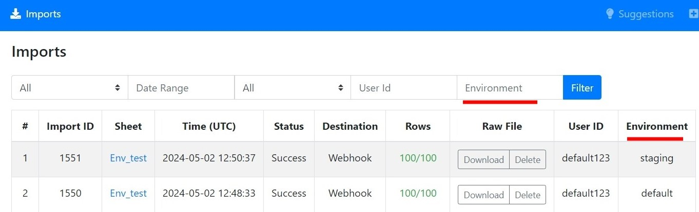
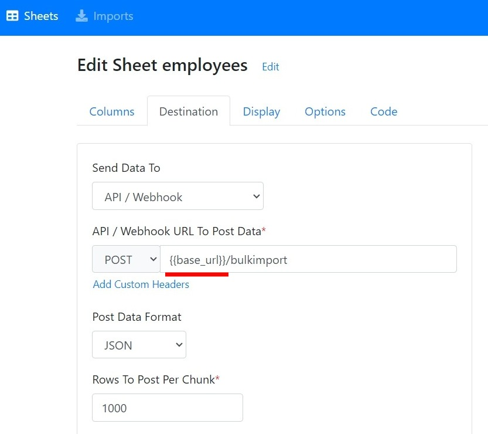
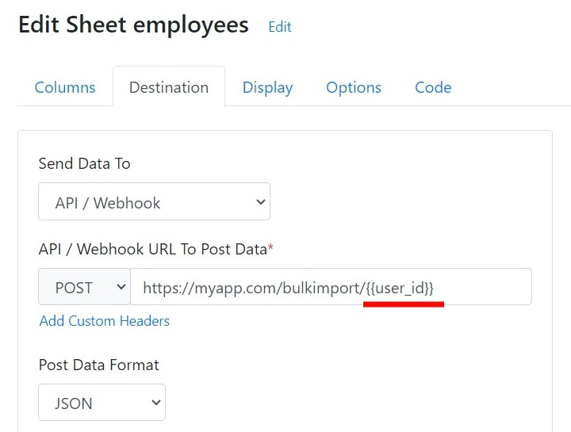

# Environment Variables

Environment variables are dynamic values defined during importer initialization and then can be accessed in the sheet configuration. They enable you to configure the environment of your importer.

The variable values passed during importer initialization will replace the placeholders referenced in the sheet settings using double curly braces.

#### Defining Environment Variables

1. Create an object **environment**.
2. Add the variables to this object in the \<key>: \<value> format.
3. Pass the **environment** object as a parameter to the importer initialization function.



Pass the **environment** object to the **CSVBoxImporter** function as shown below:

```javascript
<button class="btn btn-primary" data-csvbox disabled onclick="importer.openModal();">Import</button>
<script type="text/javascript" src="https://js.csvbox.io/script.js"></script>
<script type="text/javascript">
    function callback(result, data) {
        if(result){
            console.log("success");
            console.log(data.row_success + " rows uploaded");
            //custom code
        }else{
            console.log("fail");
            //custom code
        }
    }
    
    let importer = new CSVBoxImporter("YOUR_LICENSE_KEY_HERE", {}, callback, 
    {
	lazy: true,
	environment: {
           env_name: 'staging',
           base_url: "https://staging.mydomain.com",
           authorized_domain: "https://staging.myapp.com",
           user_id: "default123"                      
        }
    });
    
    importer.setUser({
        user_id: "default123"
    })
</script>
```




Minimum version 1.1.11 of the @csvbox/react library is required to use this feature.


Pass environment variables as an object to the **`environment`**property of the **`CSVBoxButton`** component.

```jsx
<CSVBoxButton
  licenseKey="YOUR_LICENSE_KEY_HERE"
  user={{
    user_id: "default123"
  }}  
   environment={{
     env_name: 'staging',     
     base_url: "https://staging.mydomain.com",
     authorized_domain: "https://staging.myapp.com",
     user_id: "default123"   
  }}
  
  onImport={(result, data) => {
    if(result){
      console.log("success");
      console.log(data.row_success + " rows uploaded");
      //custom code
    }else{
      console.log("fail");
      //custom code
    }
  }} 
  render={(launch, isLoading)=>{
          return <button disabled={isLoading} onClick={launch}>Upload file</button>;
      }}
>
  Import
</CSVBoxButton>
```




Minimum version 1.1.12 of the @csvbox/angular library is required to use this feature.


Pass environment variables as an object to the **`environment`**property of the AppComponent.&#x20;

```javascript
@Component({
  selector: 'app-root',
  template: `
    <csvbox-button
      [licenseKey]="licenseKey"
      [user]="user"      
      [environment]="environment"     
      [imported]="imported.bind(this)">
      Import
    </csvbox-button>
  `
})

export class AppComponent {

  title = 'example';
  licenseKey = 'YOUR_LICENSE_KEY_HERE';
  user = { user_id: 'default123' };
  environment = {
    env_name: 'staging',
    base_url: "https://staging.mydomain.com",
    authorized_domain: "https://staging.myapp.com",
    user_id: "default123"     
  };

  imported(result: boolean, data: any) {
    if(result) {
      console.log("Sheet uploaded successfully");
      console.log(data.row_success + " rows uploaded");
    }else{
      console.log("There was some problem uploading the sheet");
    }
  }
}
```




Minimum version 1.1.8 of the @csvbox/vuejs library is required to use this feature.

Minimum version 1.1.5 of the @csvbox/vuejs3 library is required to use this feature.


Pass environment variables as an object to the **`environment`**property of the **`CSVBoxButton`** component.&#x20;

```javascript
<template>
  <div id="app">
    <CSVBoxButton 
      :licenseKey="licenseKey"
      :user="user"        
      :environment="environment"        
      :onImport="onImport">
      Upload File
    </CSVBoxButton>
  </div>
</template>

<script>
import { CSVBoxButton } from '@csvbox/vuejs';

export default {
  name: 'App',
  components: {
    CSVBoxButton,
  },
  data: () => ({
    licenseKey: 'YOUR_LICENSE_KEY_HERE',
    user: {
      user_id: 'default123',
    },
     environment = {
      env_name: 'staging',
      base_url: "https://staging.mydomain.com",
      authorized_domain: "https://staging.myapp.com",
      user_id: "default123"    
    },
  }),
  methods: {    
    onImport: function (result, data) {    
       if(result){
          console.log("success");
          console.log(data.row_success + " rows uploaded");
          //custom code
      }else{
          console.log("fail");
          //custom code
      }
    }
  },
}
</script>
```




Environment variable names should not contain spaces and other special characters apart from \_ (underscore).


The **env\_name** variable name is a CSVbox reserved keyword that tags the environment. The import will be categorized in environment based on its value. You can pass values such as 'production', 'staging', 'local' to categorize the import. If no value is passed then the **env\_name** variable will default to 'default' value. The individual imports can be filtered using the **env\_name** inside CSVbox admin dashboard.

<div align="left">

<figure><figcaption><p>Filter via Environment on the Import page</p></figcaption></figure>

</div>

#### Accessing the Variables

Environment variable values will replace all the environment placeholders mentioned in the sheet settings. The placeholders are defined using double curly brackets:

_\{{ environment\_variable\_name \}}_.

For instance, to reference an environment variable named "base\_url," use the following syntax with double curly braces around the variable name:

`{{base_url}}/route-endpoint`

Using environment variables in the webhook URL allows you to dynamically adjust the webhook route based on the specific environment.

<div align="left">

<figure><figcaption><p>Defining Environment Placeholder</p></figcaption></figure>

</div>

Apart from defining the environment, these variables can be used to dynamically configure the importer based on end users or any other system parameters. For example, you can define an environment variable **user\_id** and pass it to the webhook URL to dynamically configure the URL based on the end user.

<div align="left">

<figure><figcaption><p>user_id env variable</p></figcaption></figure>

</div>


&#x20;
