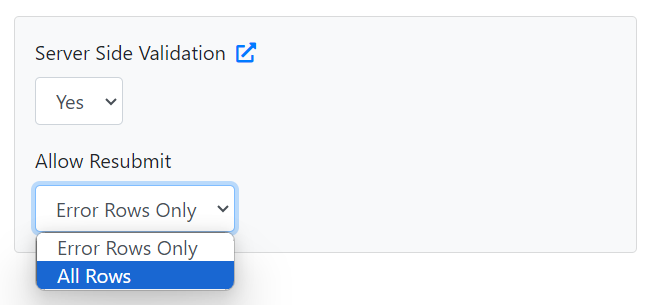

# Server Side Validation

Consider a case where you want to validate the incoming data against your business rules. This could be as simple as verifying if the user ID is found in the database or something more complex that involves custom logic. Here you want the validation to be done at your server end and relay back errors if any.

With CSVbox you have the option of server-side validation of the submitted data and returning back the errors. Then the users can fix the errors and re-submit the data.

### How it Works

<figure><figcaption><p>Server Side Validation</p></figcaption></figure>

#### 1. Activate Server Side Validation via Sheet Settings.

Go to Edit Sheet > Select Destination Tab > Enable Server Side Validation

<div align="left">

<figure><figcaption><p>Activate Server Side Validation</p></figcaption></figure>

</div>


The External Validation option is available only for the [API data destination](../destinations/#api-webhook).


#### 2. The users upload and submit the spreadsheet.

The users upload the spreadsheet, map columns, verify data, and then submit.

#### 3. The CSVbox importer pushes the data to the API endpoint configured by you.

The importer will send the spreadsheet data via POST requests with JSON values to your API endpoint. The request schema is available [here](https://help.csvbox.io/destinations#sample-json-post-to-your-api).

#### 4. Your app can then processes the data and validate it against the business rules.

Case 1: Validation is successful - no errors found. Your API returns a **`200`** HTTP response code. The success screen is displayed to the user.

<figure><figcaption><p>Success Screen</p></figcaption></figure>

Case 2: Validation failed - one or more errors found. Your API returns **`211`** HTTP response code along with the validation errors in JSON format. The error response JSON format is mentioned [here](server-side-validation.md#validation-error-json-response-format).


It is mandatory for your API to return **`211`** HTTP response status code to instruct the CSVbox importer that there are one or more server-side validation errors.



To view the results screen be sure to configure the CSVbox Result Page Settings. Go to Sheet Settings > Display > Results Page > Set **Closing the import dialog box** to **Do not close on import complete**




#### 5. Validation Fail Screen is displayed to the user.

If there are one or more server-side validation errors then the users will see the Fail Screen with a button to view the errors.

<figure><figcaption><p>Fail Screen with View Errors Button</p></figcaption></figure>

#### 6. Users can view the validation errors.

Clicking on the Errors button will take the users to the Verify Data screen with all the server-side errors displayed in yellow color.

<figure><figcaption><p>Validation Errors in Yellow Color</p></figcaption></figure>

Only the rows having the errors will be displayed.

#### 7. After fixing the errors, the users can re-submit the data.

On re-submitting the data, the process will repeat. The importer will push the data to your API endpoint via POST requests and look for errors in the response.


Each re-submit will be treated as a fresh import having a new **`Import_Id`**.


To allow the users to re-submit all the rows again (instead of error rows only) select the 'All Rows' option as shown below:

<div align="left">

<figure><figcaption><p>Re-submit All Rows</p></figcaption></figure>

</div>


### Validation Error Response JSON Format

CSVbox will expect the API endpoint to return an array of errors. Each error should specify the `row_id`, the `column` the error appeared in, and a `message` to be displayed in the UI.

#### JSON Response Schema

<table><thead><tr><th width="132.33333333333331">Parameter</th><th width="93">Type</th><th>Description</th></tr></thead><tbody><tr><td>row_id</td><td>integer</td><td>The row number of the error. Starts with 1.</td></tr><tr><td>column</td><td>string</td><td>The <a href="https://help.csvbox.io/dashboard-settings/sheet-options#column-name">column name </a>of the error. It is case sensitive.</td></tr><tr><td>message</td><td>string</td><td>The message to be displayed to the user on the validation screen of the importer.</td></tr></tbody></table>

#### JSON Response Example

```json
[
  {
    "row_id": 1,
    "column": "employee_id",
    "message": "Invalid Emp ID"
  },
  {
    "row_id": 2,
    "column": "dept",
    "message": "Department does not exist"
  },
  {
    "row_id": 3,
    "column": "employee_name",
    "message": "Employee's name has changed"
  }
]
```
