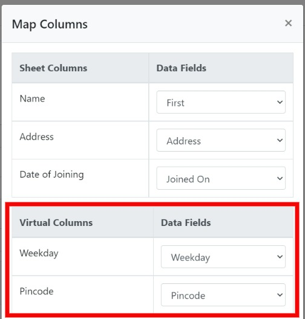

# Virtual Columns


Beta version coming soon


**Virtual Columns** are one of CSVbox’s most powerful data transformation tools.&#x20;

You can run small snippets of JavaScript that can **re-format**, **correct**, **validate**, and **enrich** incoming data during a data import.

Super useful if you need to process your data, do calculations, merge things together, etc before receiving it at your end. The sky is the limit!

### How it works

1. For any sheet, add a Virtual Column via the CSVbox dashboard.
2. Attach a Javascript snippet to the Virtual Column.
3. When users upload a CSV file, the Javascript will run to populate data in the Virtual Column.
4. Data from the uploaded CSV as well as the Virtual Column will be pushed to the data destination.

#### Example



Merge data from the _first\_name_ and the _last\_name_ columns into a new Virtual Column named _full\_name_.

Here is the attached Javascript for the _full\_name_ Virtual Column:

```javascript
try
{  	
	return csvbox.row["first_name"] + ' ' + csvbox.row["last_name"];
}
catch(err)
{  
  	return 'error: ' + err.name + ' | ' + err.message;
}
```



Normalize the incoming _order\_date_ into UTC format.

```javascript
try
{  	const date = new Date(csvbox.row["order_date"]);

	return date.toUTCString();
}
catch(err)
{  
  	return 'error: ' + err.name + ' | ' + err.message;
}
```



### Adding Virtual Columns

1. Go to the edit sheet page > **Columns** tab > Click **Add Virtual Column** button.
2. Add Virtual **Column Name**.
3. Provide **Javascript** code.
4. Attach **Dependent** libraries (optional).
5. Click **Save**.

<figure><figcaption><p>Add Virtual Column</p></figcaption></figure>

### Data Rows

Data rows are the core object that Virtual Columns are built around. For each incoming CSV data row, you can read its data and manipulate it via Javascript to add to the Virtual Column.

After the user submits the CSV, the Javascript will run for each data row in sequential order to populate Virtual Columns.

The `csvbox.row` object is available to work with each row. You can use `csvbox.row["column_name"]` to read the specific column of the data row. Utilize data from a single column, multiple columns, or no columns to process via Javascript and populate Virtual Columns.&#x20;

### Adding Data to Virtual Columns

The value returned by the Javascript snippet is added to the Virtual Column.&#x20;

```javascript
// Extracting first name    
try
{  	var fullName = csvbox.row["full_name"].split(' '),

	// retruning value
	return  fullName[0];
}
catch(err)
{  
	//returning error
  	return 'error: ' + err.name + ' | ' + err.message;
}
```


If Javascript returns a `NULL` value, an empty string will be added to the Virtual Column.


### Receiving Virtual Data

The Virtual Column data is available in all the data destinations along with the data from the regular columns.



In the API response JSON object, the dynamic data will be displayed inside the **\_virtual\_data** object as shown below. The **\_virtual\_data** object will be visible only if the Virtual Columns are added to the sheet. In the example below check lines 12 and 31.


```json
[
  {
    "import_id": 79418895,
    "sheet_id": 55,
    "sheet_name": "Products",
    "row_number": 1,
    "row_data": {
          "Name": "TP-Link TL-WN822N Wireless Adapter",
          "SKU": "AS-100221",
          "Price": "33.00",
          "Quantity": "3",
          "_virtual_data":{
		"SKU_prefix": "AS",
		"Compare_Price": "43.00"
           }
    },
    "custom_fields": {
      "user_id": "1002"
    }
  },
  {
    "import_id": 79418895,
    "sheet_id": 55,
    "sheet_name": "Products",
    "row_number": 2,
    "row_data":{
          "Name": "EPower EP-600PM Power Supply Cooling Fan",
          "SKU": "SS-103824",
          "Price": "95.35",
          "Quantity": "8",
           "_virtual_data":{
		"SKU_prefix": "SS",
		"Compare_Price": "105.35"
           }
        },
    "custom_fields": {
      "user_id": "1002"
    }
  },
]
```




Virtual Columns will be available in the column mapping modal. You can push Virtual Columns to any receiving data field of your choice.

<figure><figcaption><p>Mapping Virtual Columns</p></figcaption></figure>



In the AWS S3 file store, the Virtual Columns will be added as new columns in the uploaded file.



### Dependencies

coming soon

### Environment Variables

coming soon
