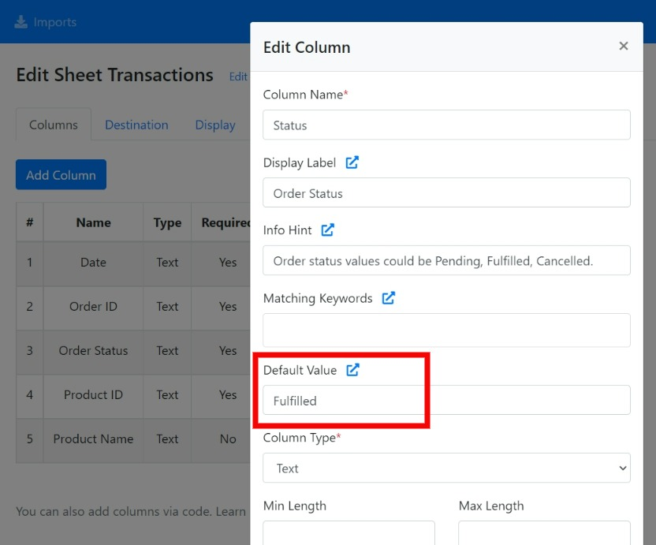
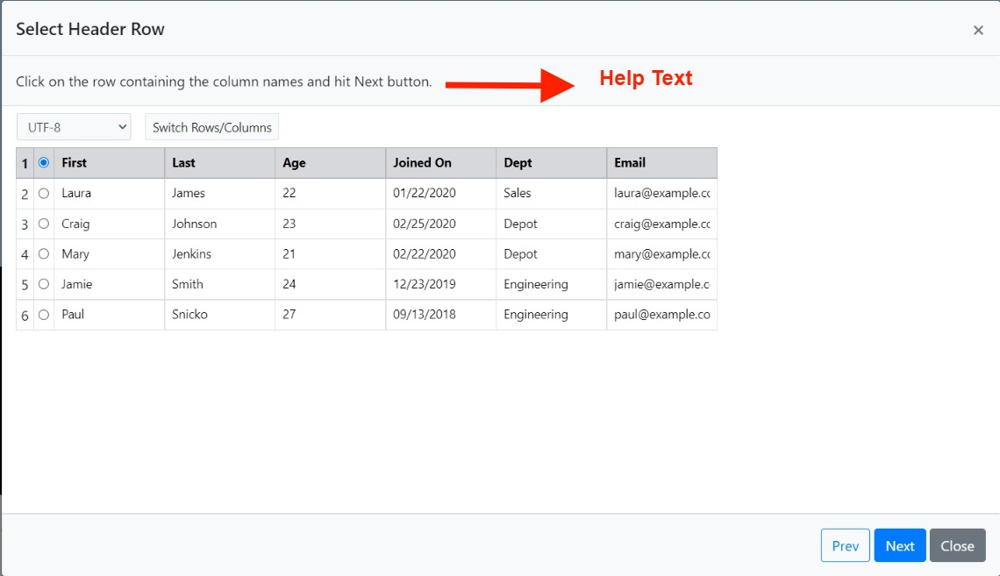
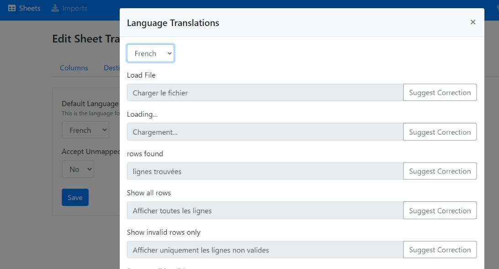
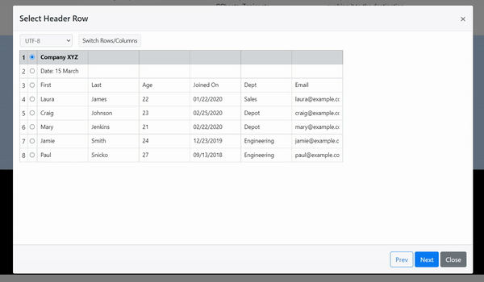

# Change Log

## 30 Sep 2022

* Updated [DPA ](legal/gdpr/data-processing-addendum.md)to add Europe Data Residency option.

## 22 Sep 2022

* Added the option to select Europe (Germany) location for data residency. More info [here](dashboard-settings/sheet-options-1.md#server-and-data-location).

## 05 Sep 2022

* Added Hebrew language for importer frontend

## 01 Sep 2022

* Added **Time** Column type validation.
* The 100 column sheet restriction removed.

## 30 Aug 2022

* Added [Virtual Columns](advanced-installation/virtual-columns.md). Create new columns by applying custom data transformation logic.

## 26 Aug 2022

* Added the Romanian language option for the importer frontend

## 25 Aug 2022

* Added [Import Link disable](advanced-installation/import-links.md#activating-import-links) option

## 24 August 2022

* Added option to control[ import dialog size](dashboard-settings/sheet-options-1.md#importer-dialog-size)
* Added decimal / integer validation

## 23 August 2022

* Updated React, Angular and Vuejs libraries for [onSubmit Importer event](getting-started/2.-install-code.md#events)

## 16 August 2022

* Added [onSubmit Importer event](getting-started/2.-install-code.md#events)

## 10 August 2022

* You now have the option to specify a default filler value for the column in case the incoming data is blank.&#x20;

## 08 August 2022

* Added [domain authorization](dashboard-settings/sheet-options-1.md#domain-authorization) option. You can provide a list of approved _domains/sub-domains_ for embedding the importer. The embedded importer will work on the whitelisted domains only.

## 03 August 2022

* Added functionality to configure custom success or failure messages at import complete. More info [here](dashboard-settings/sheet-options-1.md#import-complete-messages).

## 01 August 2022

* Added [dynamic column](advanced-installation/dynamic-columns.md) support for [Depenedent List](dashboard-settings/validations.md#dependent-list) and [Dependent Dynamic List](dashboard-settings/validations.md#dependent-dynamic-list) columns.
* Added the Polish language option for the importer frontend.

## 29 July 2022

* Added the Thai language option for the importer frontend.

## 22 July 2022

* Added options for controlling the close of importer dialog after the import is complete. 

## 20 July 2022

* Added [Dependent Dynamic List Columns](dashboard-settings/validations.md#dependent-dynamic-list).

## 07 July 2022

* Added **column\_mappings** object to the [import complete webhook](getting-started/3.-receive-data.md#import-complete-webhook) and the [callback function](getting-started/2.-install-code.md#callback-function). The **column\_mappings** object contains the user-defined mappings between the columns of the sheet (template) and columns in the uploaded CSV file.
* Added the **Import ID** column in the table on the Imports page of the CSVbox dashboard.
* The dynamic columns now support multiple date validation.

## 01 July 2022

* Added an **Export** button that downloads the validation errors and row data in an Excel sheet. More info [here](dashboard-settings/sheet-options-1.md#export-button).
* Updated importer UI to show the truncated row count.

## 30 June 2022

* Added Max Rows option to the importer dashboard. It limits the number of rows per import.

## 29 June 2022

* Added phone number validation based on the [libphonenumber.js library](https://catamphetamine.gitlab.io/libphonenumber-js/).
* Minor UI changes to the import modal. Changes include:
  * The importer modal is now full screen across all devices.
  * The column mapping table & validation error text are center-aligned for better visibility.

## 27 June 2022

* New styling options added - upload logo and custom fonts.

## 24 June 2022

* Added the Arabic language (ltr) support for the importer frontend.

## 23 June 2022

* Added option to allow displaying the import fail error messages to the end-user.

## 22 June 2022

* Added **Primary Color** custom theme option. You can stylize the importer with the primary color of your brand. More styling options coming soon.

## 10 June 2022

* The importer will attach the [custom user attributes](getting-started/2.-install-code.md#referencing-the-user) as query parameters to the [Dynamic List](dashboard-settings/validations.md#dynamic-list) API request. **csvbox\_** prefix will be added to the custom user attribute query parameters. This will help you identify the users/environment and return back a relevant list of values.

## 30 May 2022

* Added **Upsert** operation to MySQL, PostgreSQL and MS SQL data destinations. Instead of directly inserting the file data to the databases, the importer will first check if the record exists. If the record exists, then the row will be updated. Only if the record does not exist then a new row will be added.

## 23 May 2022

* Added [Dynamic List](dashboard-settings/validations.md#dynamic-list) column type to accept valid list values via API, real-time.

## 20 May 2022

* New display options for the 'Select Header Row' page of the importer.

1. **Skip this step?** - Hide/Show the 'Select header row' page to the users.
2. **Show encoding** - Hide/Show the character set selection list to the users.
3. **Switch Row/Columns** - Hide/Show the option to switch rows and columns to the users.

These settings help to remove the non-essential options from the importer and make the user experience cleaner.

## 19 May 2022

* Added the option (DELETE button on Accounts page) to delete and close down the CSVbox account permanently.

## 12 May 2022

* Added 'Multiple' option to Date Type columns. With this, you can provide multiple date formats that are allowed for the incoming data.

## 11 May 2022

* Added the option to receive the CSV data in JSON format in the callback function. More info [here](getting-started/3.-receive-data.md#data-at-the-client-side).

## 04 May 2022

* Added [Notion Data Destination](destinations/notion.md)
* Fixed a bug for very large file uploads with [REST FileAPI](advanced-installation/rest-file-api.md)

## 02 May 2022

### Added

* [SQL Server Data Destination](destinations/#sql-server)

## 26 April 2022

### Added

* ****[**allow\_invalid** option](https://help.csvbox.io/getting-started/2.-install-code#allow\_invalid)

## 22 April 2022

### Added

* Ability to add help texts for each page (header selection, column mapping, data validation) on the importer

## 13 April 2022

### Added

* Yearly pricing plans
* [REST File API](advanced-installation/rest-file-api.md) beta
* New [importer events](getting-started/2.-install-code.md#events) (onReady, onClose)
* [request\_headers](getting-started/2.-install-code.md#request\_headers) option to send headers at run-time
* PATCH request type
* **total\_rows** parameter to the [API output](getting-started/3.-receive-data.md#sample-response).
* **original\_filename** parameter to the [import complete webhook](getting-started/3.-receive-data.md#import-complete-webhook) and importer [callback function](getting-started/2.-install-code.md#callback-function).

### Updated

* Fixed issue related to freezing of the importer
* Updated the code from Laravel 8 to Laravel 9
* Added new layers of database security
* Fixed issue related to the downloading of the template files
* Added custom attribute mapping for Airtable&#x20;
* UI enhancements

## 07 March 2022

### Added

* Custom message for regex validation.

## 01 March 2022

### Added

* Portuguese language support for the importer frontend.
* [**language** sheet option](https://help.csvbox.io/getting-started#additional-options) to select the frontend language while initializing the importer.

## 23 February 2022

### Updated

* You can now view the translated texts for all supported languages and submit suggestions for changes.

## 22 February 2022

### Added

* Dutch language support for the importer frontend.

## 11 February 2022

### Added

* [Unmapped Columns](advanced-installation/unmapped-columns.md): Allowing users to submit columns not included in the sheet template.

## 08 February 2022

### Added

* [FTP Data Destination](destinations/#ftp-server)

## 07 February 2022

### Added

* Header row selection step in the importer.

## 03 February 2022

### Added

* Importer internationalization. The importer now supports German, French and Spanish languages.

## 17 January 2022

### Added

* [max\_rows](https://help.csvbox.io/getting-started#additional-options) config option to restrict the number of rows uploaded in a single sheet.

## 10 January 2022

### Added

* [Zapier Data Destination](destinations/zapier.md)

## 4 January 2022

### Updated

* Included 'Custom' validation option for Date Type columns. Date formatting options available [here](https://help.csvbox.io/validations#date).

## 29 December 2021

### Added

* Option to add data manually up copy-pasting from any spreadsheet.

## 15 December 2021

### Added

* The option to transpose (switch) rows and columns in the user datasheet. This helps to accept spreadsheets having horizontal data.

### Updated

* The list type column can now accept any number of valid values. Developers can configure the values via a CSV file.
* The end users can search/select the list values from a popup.

 (1).png>)

## 07 December 2021

### Added

* [Google Sheets data destination](https://help.csvbox.io/destinations#google-sheets)

## 26 November 2021

### Added

* [Airtable data destination](destinations/#airtable)

### Updated

* Made boolean column type case insensitive

## 14 November 2021

### Added

* [Dynamic Columns (Beta)](dashboard-settings/sheet-options.md)

## 28 October 2021

### Added

* [PostgreSQL data destination](https://help.csvbox.io/destinations#postgresql)

### Updated

* Fixed dashboard bugs
* Fixed UI bugs of the importer
* Added Display Labels to [List Column Type](https://help.csvbox.io/validations#list).

## 11 October 2021

### Added

* Usage stats on the app dashboard

## 05 October 2021

### Added

* [Bubble integration](https://help.csvbox.io/destinations/bubble.io)

## 28 September 2021

### Added

* The display order of the columns in the importer can now be changed by simply drag-dropping in the dashboard.

* Ability to add rows directly in the importer.

* Added Column Info Hints. Info Hints are help tooltips that will get displayed when the users hover the mouse over the Column Name (or click it) in the importer. They are useful to convey additional information about the Column.

### Updated

* The settings now allow skipping of the CSV data to be stored in csvbox s3 storage.

## 15 September 2021

### Added

* Multiple Encoding support. The users can now select/change the Character Set when they upload a CSV.

* Display options for adding customizable title, help text and downloadable sample CSV on the importer.

## 09 September 2021

### Added

* VueJs integration.

### Updated

* Increased the size of the file drop area on the importer.
* Required columns will now have a \* mark on the column mapping page of the importer.

### Fixed

* Intermitted failed imports problem. It was related to the Cloudflare CDN issue.

## 31 August 2021

### Added

* 'Remove All' button to delete the invalid rows all at once.

* Big-endian validation for date type columns.

## 30 August 2021

It was been a busy month for the csvbox team as we reworked the entire architecture and introduced some new features.

### Added

* A new Plus plan with an increased limit of 500,000 rows per import

* **Intelligent Column Mapping** - Based on the historical columns mapped by the users, the importer will now automatically map the columns for new imports so that the users don't have to.
* **Matching Keywords** - You can provide a set of keywords as alternative matching options to help users match column names automatically. For example, let's say you have a column name 'First Name'. If you think a lot of your users might have sheets with columns as 'F\_Name' or simply 'First', then you can add two matching keywords 'F\_Name' and 'First'. The importer will then automatically match columns to the specified keywords to speed up column mapping.
* ****[**MySQL Data Destination**](https://help.csvbox.io/destinations#mysql-database) - Push customer CSV data directly to your MySQL Database Tables.

### **Fixed**

* UI bugs

## 26 July 2021

### Added

* In addition to the Column Name, you can now add Display Label for any sheet column. Display Labels will replace the Column Names in the header row that the user will see while doing an import.

### Changed

* Fixed Date validation bug.

## 20 July 2021

### Added

* Angular Integration

## 13 July 2021

### Added

* React Integration

## 07 July 2021

### Added

* A new **`Data`** variable is returned via the **`callback`** function of the integration code. This variable contains the details of the completed import. More information [here](https://help.csvbox.io/getting-started#callback-function). This change is backward compatible with the old integration code.

## 30 June 2021

### Changed

* Fixed UI bugs.
* Optimized importer for faster speed.

## 11 June 2021

### Added

* New column type 'List'. You can now specify a list of allowed values for a column. The importer will validate the column data with the list of values configured.
* Min, Max values validation for Number type columns.
* Min, Max character length validation option for Text type columns.

## 09 June 2021

### Added

* Multiple custom user attributes to reference the users and identify them in your platform. More info here - [https://help.csvbox.io/getting-started#referencing-the-user](https://help.csvbox.io/getting-started#referencing-the-user)

## 28 May 2021

### Added

* A sheet copy button to quickly make duplicate sheets.

## 24 May 2021

### Added

* A new optional method **setUser()** to the sheet integration code. With the **setUser()** method you can reference the user by providing the value to the **user\_id** option. This helps you identify and match imports to their respective users from within your system.

### Changed

* Updated pricing plans.

## 21 May 2021

### Added

* Support for adding custom headers for all webhooks.

## 18 May 2021

### Changed

* Fixed a few edge case data input scenarios for CSV files.
* Improved the speed of import.

## 29 April 2021

### Added

* Boolean, Regex, IP, URL, Credit Card type validations for sheet columns.

### Removed

* csvbox.io branding for paid plans.&#x20;

## 20 April 2021

### Added

* Amazon S3 destination type. You can now push the user uploaded files directly to your S3 bucket

## 12 April 2021

### Added

* Encryption for the user-uploaded files.
* Validation check for restricting files more than 15MB in size.

### Changed

* Enhancements for faster uploads

## 19 Mar 2021

### Added

* Settings page under the top right menu

* Delete Files Policy to provide an option to get all the user files deleted as soon as the upload is complete.

### Changed

* Filter UI on the Import Page

## 03 Mar 2021

### Added

* Date type validation for the sheet columns

### Fixed

* UI bugs on the importer widget

## 18 Feb 2021

### Added

* You can now subscribe to a webhook that will be triggered each time an import event is completed.

### Fixed

* CDN file caching problem.

## 10 Feb 2021

### Added

* Added a callback function to the sheet integration code. This function will be invoked client side each time an import event is completed.

## 20 Dec 2020

### Fixed

* UI errors on the Imports page.

### Changed

* Location of the plans page. Moved it under the User menu.

## 14 Dec 2020

### Added

* Introduced csvbox.io to the world

