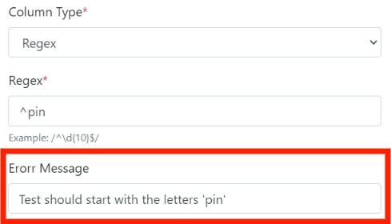

# Change Log

## 07 July 2023

* Added [sample\_template\_url ](getting-started/2.-install-code.md#sample\_template\_url)and [sample\_template\_button\_text ](getting-started/2.-install-code.md#sample\_template\_button\_text)configuration options. With these, you can now configure a dynamic sample template file for each user.

## 27 June 2023

* Added [Ignored columns](advanced-installation/ignored-columns.md) - allow users to skip columns for data submission.

## 16 June 2023

* Infrastructure changes
* Bug fixes

## 15 May 2023

* Added functionality to hide copy-paste data option.
* Added option to skip confirmation message when accepting invalid data.
* UI enhancements to improve the speed of the admin dashboard.
* Enabled multiple importers on the same page for the Bubble plugin.
* Performance improvements across all destinations.

## 12 April 2023

* Few UI enhancements. Now the entire row gets highlighted when there is a validation issue in any one cell.

## 06 April 2023

* Added [Private Mode](destinations/private-mode.md) for data processing.

## 27 Mar 2023

* Added [Server Side Validation](advanced-installation/server-side-validation.md) (Beta) feature

## 09 Mar 2023

* Added the Danish language to the importer.

## 06 Mar 2023

* Added option to select between Sequential and Parallel sending of data via webhooks. More info [here](https://help.csvbox.io/destinations#request-type).

## 27 Feb 2023

* Option to add a new sheet in Google Sheets for each file upload.

## 17 Feb 2023

* Added the importer event [onLoadStart](getting-started/2.-install-code.md#onloadstart). It gets triggered when the importer iFrame starts loading.

## 14 Feb 2023

* Added [Upsert ](destinations/#2.-upsert)operation for Airtable.

## 09 Feb 2023

* Option to disable [user keywords](dashboard-settings/sheet-options.md#matching-keywords) based column mapping.

## 06 Feb 2023

* Added [`position` ](advanced-installation/dynamic-columns.md#column-position)parameter to control the display order of the dynamic columns.

## 24 Jan 2023

* Added [Lazy Load](https://help.csvbox.io/getting-started/2.-install-code#lazy-load) option for importer initialization.
* Added multiple-level List-Dependent List validations.
* Added info icons on the Column Mapping page.
* Updated email validation to accept special characters.
* Fixed bugs, improved notifications and made minor UI changes to the admin section.

## 04 Jan 2023

* Added the Japanese language to the importer.

## 29 Dec 2022

* Added option to skip Column Mapping screen if there is an exact match of columns.

## 26 Dec 2022

* Added support for delimiters such as "." and "|" for [Multi-select List](https://help.csvbox.io/dashboard-settings/validations#multi-select-list) and [Dynamic Multi-select List](https://help.csvbox.io/dashboard-settings/validations#dynamic-multi-select-list) column types.&#x20;

## 18 Dec 2022

* Added Slovenian language.
* Added the option to provide help text in multiple languages.

## 05 Dec 2022

* `csvbox.row["total_rows"]` and `csvbox.row["row_number"]` [data variables](advanced-installation/virtual-columns.md#csvbox.row) added to Virtual Columns.
* [`csvbox.virtual`](advanced-installation/virtual-columns.md#csvbox.virtual) object added to Virtual Columns.

## 29 Nov 2022

* Added [1-click Resubmit button](dashboard-settings/sheet-options-1.md#1-click-to-resubmit-the-same-csv-file-again) to trigger a new import on the recently submitted file.

<figure><figcaption>
Resubmit
</figcaption></figure>

## 25 Nov 2022

* Added [Multi-select List](https://help.csvbox.io/dashboard-settings/validations#multi-select-list) and [Dynamic Multi-select List](https://help.csvbox.io/dashboard-settings/validations#dynamic-multi-select-list) column types.&#x20;

## 21 Nov 2022

* Added option to view and delete [User Keywords](https://help.csvbox.io/dashboard-settings/sheet-options#matching-keywords).

.jpg>)

## 16 Nov 2022

* Added a Reset All Mappings button to make it easier for the users to reset and remap the columns. This button is optional and its visibility can be controlled via the Sheet settings page.

<figure><figcaption>
Reset Mappings Button
</figcaption></figure>

## 14 Nov 2022

* Added the Italian language option for the importer front end.
* Added option to Copy sheet settings to an existing sheet. The data destination config and license key remain the same in the target sheet.

## 29 Oct 2022

* Optimized SQL Server integration code to improve speed.
* Added **data\_location** initialization parameter for specifying data and server location.

## 13 Oct 2022

* Fixed UI buys related to **max\_rows** option.
* Upgraded infrastructure and added optimizations for improved speed for EU region.
* Improved performance for imports with many Virtual Columns.

## 30 Sep 2022

* Updated [DPA ](legal/gdpr/data-processing-addendum.md)to add Europe Data Residency option.

## 22 Sep 2022

* Added the option to select Europe (Germany) location for data residency. More info [here](dashboard-settings/sheet-options-1.md#server-and-data-location).

## 05 Sep 2022

* Added Hebrew language for importer frontend.

## 01 Sep 2022

* Added **Time** Column type validation.
* The 100 column sheet restriction removed.

## 30 Aug 2022

* Added [Virtual Columns](advanced-installation/virtual-columns.md). Create new columns by applying custom data transformation logic.

## 26 Aug 2022

* Added the Romanian language option for the importer frontend

## 25 Aug 2022

* Added [Import Link disable](advanced-installation/import-links.md#activating-import-links) option

## 24 August 2022

* Added option to control[ import dialog size](dashboard-settings/sheet-options-1.md#importer-dialog-size)
* Added decimal / integer validation

## 23 August 2022

* Updated React, Angular and Vuejs libraries for [onSubmit Importer event](getting-started/2.-install-code.md#events)

## 16 August 2022

* Added [onSubmit Importer event](getting-started/2.-install-code.md#events)

## 10 August 2022

* You now have the option to specify a default filler value for the column in case the incoming data is blank.&#x20;

## 08 August 2022

* Added [domain authorization](dashboard-settings/sheet-options-1.md#domain-authorization) option. You can provide a list of approved _domains/sub-domains_ for embedding the importer. The embedded importer will work on the whitelisted domains only.

## 03 August 2022

* Added functionality to configure custom success or failure messages at import complete. More info [here](dashboard-settings/sheet-options-1.md#import-complete-messages).

## 01 August 2022

* Added [dynamic column](advanced-installation/dynamic-columns.md) support for [Depenedent List](dashboard-settings/validations.md#dependent-list) and [Dependent Dynamic List](dashboard-settings/validations.md#dependent-dynamic-list) columns.
* Added the Polish language option for the importer frontend.

## 29 July 2022

* Added the Thai language option for the importer frontend.

## 22 July 2022

* Added options for controlling the close of importer dialog after the import is complete. 

## 20 July 2022

* Added [Dependent Dynamic List Columns](dashboard-settings/validations.md#dependent-dynamic-list).

## 07 July 2022

* Added **column\_mappings** object to the [import complete webhook](getting-started/3.-receive-data.md#import-complete-webhook) and the [callback function](getting-started/2.-install-code.md#callback-function). The **column\_mappings** object contains the user-defined mappings between the columns of the sheet (template) and columns in the uploaded CSV file.
* Added the **Import ID** column in the table on the Imports page of the CSVbox dashboard.
* The dynamic columns now support multiple date validation.

## 01 July 2022

* Added an **Export** button that downloads the validation errors and row data in an Excel sheet. More info [here](dashboard-settings/sheet-options-1.md#export-button).
* Updated importer UI to show the truncated row count.

## 30 June 2022

* Added Max Rows option to the importer dashboard. It limits the number of rows per import.

## 29 June 2022

* Added phone number validation based on the [libphonenumber.js library](https://catamphetamine.gitlab.io/libphonenumber-js/).
* Minor UI changes to the import modal. Changes include:
  * The importer modal is now full screen across all devices.
  * The column mapping table & validation error text are center-aligned for better visibility.

## 27 June 2022

* New styling options added - upload logo and custom fonts.

## 24 June 2022

* Added the Arabic language (ltr) support for the importer frontend.

## 23 June 2022

* Added option to allow displaying the import fail error messages to the end-user.

## 22 June 2022

* Added **Primary Color** custom theme option. You can stylize the importer with the primary color of your brand. More styling options coming soon.

## 10 June 2022

* The importer will attach the [custom user attributes](getting-started/2.-install-code.md#referencing-the-user) as query parameters to the [Dynamic List](dashboard-settings/validations.md#dynamic-list) API request. **csvbox\_** prefix will be added to the custom user attribute query parameters. This will help you identify the users/environment and return back a relevant list of values.

## 30 May 2022

* Added **Upsert** operation to MySQL, PostgreSQL and MS SQL data destinations. Instead of directly inserting the file data to the databases, the importer will first check if the record exists. If the record exists, then the row will be updated. Only if the record does not exist then a new row will be added.

## 23 May 2022

* Added [Dynamic List](dashboard-settings/validations.md#dynamic-list) column type to accept valid list values via API, real-time.

## 20 May 2022

* New display options for the 'Select Header Row' page of the importer.

1. **Skip this step?** - Hide/Show the 'Select header row' page to the users.
2. **Show encoding** - Hide/Show the character set selection list to the users.
3. **Switch Row/Columns** - Hide/Show the option to switch rows and columns to the users.

These settings help to remove the non-essential options from the importer and make the user experience cleaner.

## 19 May 2022

* Added the option (DELETE button on Accounts page) to delete and close down the CSVbox account permanently.

## 12 May 2022

* Added 'Multiple' option to Date Type columns. With this, you can provide multiple date formats that are allowed for the incoming data.

## 11 May 2022

* Added the option to receive the CSV data in JSON format in the callback function. More info [here](getting-started/3.-receive-data.md#data-at-the-client-side).

## 04 May 2022

* Added [Notion Data Destination](destinations/notion.md)
* Fixed a bug for very large file uploads with [REST FileAPI](advanced-installation/rest-file-api.md)

## 02 May 2022

### Added

* [SQL Server Data Destination](destinations/#sql-server)

## 26 April 2022

### Added

* [**allow\_invalid** option](https://help.csvbox.io/getting-started/2.-install-code#allow\_invalid)

## 22 April 2022

### Added

* Ability to add help texts for each page (header selection, column mapping, data validation) on the importer

## 13 April 2022

### Added

* Yearly pricing plans
* [REST File API](advanced-installation/rest-file-api.md) beta
* New [importer events](getting-started/2.-install-code.md#events) (onReady, onClose)
* [request\_headers](getting-started/2.-install-code.md#request\_headers) option to send headers at run-time
* PATCH request type
* **total\_rows** parameter to the [API output](getting-started/3.-receive-data.md#sample-response).
* **original\_filename** parameter to the [import complete webhook](getting-started/3.-receive-data.md#import-complete-webhook) and importer [callback function](getting-started/2.-install-code.md#callback-function).

### Updated

* Fixed issue related to freezing of the importer
* Updated the code from Laravel 8 to Laravel 9
* Added new layers of database security
* Fixed issue related to the downloading of the template files
* Added custom attribute mapping for Airtable&#x20;
* UI enhancements

## 07 March 2022

### Added

* Custom message for regex validation.

## 01 March 2022

### Added

* Portuguese language support for the importer frontend.
* [**language** sheet option](https://help.csvbox.io/getting-started#additional-options) to select the frontend language while initializing the importer.

## 23 February 2022

### Updated

* You can now view the translated texts for all supported languages and submit suggestions for changes.

## 22 February 2022

### Added

* Dutch language support for the importer frontend.

## 11 February 2022

### Added

* [Unmapped Columns](advanced-installation/unmapped-columns.md): Allowing users to submit columns not included in the sheet template.

## 08 February 2022

### Added

* [FTP Data Destination](destinations/#ftp-server)

## 07 February 2022

### Added

* Header row selection step in the importer.

## 03 February 2022

### Added

* Importer internationalization. The importer now supports German, French and Spanish languages.

## 17 January 2022

### Added

* [max\_rows](https://help.csvbox.io/getting-started#additional-options) config option to restrict the number of rows uploaded in a single sheet.

## 10 January 2022

### Added

* [Zapier Data Destination](destinations/zapier.md)

## 4 January 2022

### Updated

* Included 'Custom' validation option for Date Type columns. Date formatting options available [here](https://help.csvbox.io/validations#date).

