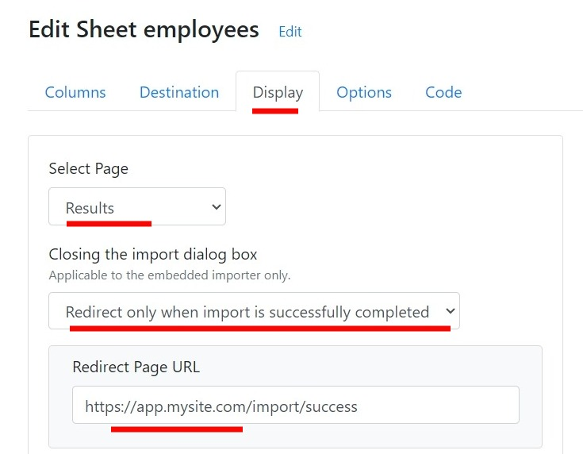

# Change Log

## November 2025

* Added [Supabase ](destinations/supabase.md)as data destination.
* Newly supported languages include:
  * Chinese (Simplified) - zh-CN
  * Chinese (Traditional) - zh-TW
* Added the **Hide Cancel Button** option to hide the Cancel button located at the bottom-right corner of the importer. More information [here](dashboard-settings/sheet-options-1.md#hide-cancel-button).

## 09 October 2025

*   Added a new feature allowing users to select accepted file types for uploads — choose between **CSV**, **XLS**, and **XLSX** formats in your sheet settings.\

    <figure><figcaption></figcaption></figure>

## 25 September 2025

* **Added – Language Support**\
  We’ve expanded CSVBox’s multilingual capabilities! Newly supported languages include:
  * Hindi (`hi`)
  * Bahasa Malaysia (Malay) (`ms`)
  * Russian (`ru`)
  * Vietnamese (`vi`)
  * Korean (`ko`)
  * Bahasa Indonesia (`id`)
  * Egyptian Arabic (`ar-EG`)
  * Urdu (`ur`)

## 08 September 2025

* **New:** [Server-Side Validation](advanced-installation/server-side-validation.md) supports **table** and **row** error types.
* **UX:** Table errors render in an alert banner above the grid; row errors appear as a badge on the row number with a pop-over on click.

<figure><figcaption></figcaption></figure>

* **API:** You can mix `table`, `row`, and `cell` errors in one response. `type` is optional and defaults to `cell`. **No breaking changes.**

## 28 August 2025

* Added option to set the default row on the header selection screen. You can now choose which row is pre-selected on the Header Selection step.&#x20;
* Also available as an installation parameter - [**`default_header_row`**](getting-started/2.-install-code.md#default_header_row).\
  \
   (1).png>)

## 14 August 2025

* Added [**Test API**](destinations/#test-api) destination **—** sends spreadsheet data to a unique [`webhooks.csvbox.io`](https://webhooks.csvbox.io/) URL (testing-only).

## 17 July 2025

* Added support for custom error messages (via `error_message` validator) for [regex type dynamic columns](https://help.csvbox.io/advanced-installation/dynamic-columns#validator-options).
* You can now use the `excel_value` validator with number-type dynamic columns to control whether to import **raw** or **formatted** values from Excel.

## 16 July 2025

*   **Environment Variable Support for APIs** – You can now use environment variables in:

    1. Dynamic List API
    2. Multi-select Dynamic List API
    3. Success Message API
    4. Failed Message API
    5. Custom headers for all the above

    This makes it easier to manage configuration across environments.\
    \
    .png>)

## 08 July 2025

* The importer now supports **dark** and **custom dark** themes for a better user experience.
* Added a [`theme`](https://help.csvbox.io/getting-started/2.-install-code#theme) selection option in the installation code for applying the theme at runtime.

## 12 June 2025

*   Added **Excel Value Formatting Options** – Choose how numeric values are imported:

    * **Formatted**: As shown in Excel (e.g., "$1,200.00", "15%").
    * **RAW**: Strips formatting for clean numbers (e.g., 1200, 0.15).

    Ideal for better control in calculations and validations. More info [here](https://help.csvbox.io/dashboard-settings/validations#values-for-excel-setting).

## 20 May 2025

* Added MongoDB as data destination.

## 29 April 2025

* Introduced **AI Bulk Transformations**, allowing users to apply AI-driven changes to uploaded data using natural language prompts — all directly in the importer. Supports multi-language input, column-level modifications, and ensures complete privacy with no external data sharing. More information [here](dashboard-settings/ai-bulk-transforms.md).

## 17 April 2025

* Introduced a setting to choose the default table view on the Verify Data screen — users can now select between "Show all rows" and "Show invalid rows only."

<figure><figcaption></figcaption></figure>

<figure><figcaption></figcaption></figure>

* Added a configuration option to set the default number of rows displayed on the Verify Data screen.

<figure><figcaption></figcaption></figure>

<figure><figcaption></figcaption></figure>

## 14 April 2025

* **Introduced the `column.isUnmapped` property** in the [`csvbox.columns`](advanced-installation/data-transforms.md#csvbox.columns) object to identify Unmapped Columns. This is now available in Data Transforms and Validation Functions.
* Added support for Unmapped Columns in Server Side Validation, allowing validation errors to be shown for Unmapped Columns.

## 07 April 2025

* Added support for bulk adding columns using a sample CSV file. More info [here](dashboard-settings/add-columns-via-csv.md).

## 26 March 2025

* **Introduced the `column.isDynamic` property** in the [`csvbox.columns`](advanced-installation/data-transforms.md#csvbox.columns) object to identify Dynamic Columns. This is now available in Data Transforms and Validation Functions.
* Introduced a new configuration option to restrict adding new rows on the Verify Data screen.

<figure><figcaption>
Adding rows option
</figcaption></figure>

## 21 March 2025

* Added OpenAI to the list of [Sub Processors](legal/gdpr/data-processing-addendum.md#sub-processors) in the [DPA](legal/gdpr/data-processing-addendum.md).&#x20;
* Why is OpenAI added as a subprocessor?\
  CSVbox leverages OpenAI’s industry-leading AI capabilities to enhance functionality within the importer app. As we build new AI-powered features, OpenAI has been included as a subprocessor.&#x20;

## 20 March 2025

* Added support for file submissions without requiring predefined template columns. Check out [Zero Template Column](dashboard-settings/sheet-options-1.md#zero-template-columns) functionality

## 17 March 2025

* Expanded styling options with customizable colors, fonts, and layout sizes, allowing for a more consistent and professional appearance.

<figure><figcaption></figcaption></figure>

## 12 March 2025

* Added [Mapping Choices](dashboard-settings/sheet-options-1.md#mapping-choice) - option for customers to map file columns to template fields or template fields to file columns.

## 11 February 2025

* Support for [Environment Variables](advanced-installation/environment-variables.md) is now available in [Validation Functions](advanced-installation/validation-functions.md#csvbox.environment), [Data Transforms](advanced-installation/data-transforms.md#csvbox.environment), and [Virtual Columns](advanced-installation/virtual-columns.md#csvbox.environment).

## 24 January 2025

* Relocated the[ File Delete Policy](dashboard-settings/sheet-options-1.md#file-delete-policy) from account-level settings to sheet-level settings.

## 14 January 2025

* Introduced the [`csvbox.columns`](advanced-installation/data-transforms.md#csvbox.columns) object for use in Data Transforms and Validation Functions.

## 06 January 2025

* Added [**auto\_map** ](advanced-installation/rest-file-api.md#request-body)attribute to the REST File API to activate automatic column mapping during file submission.

## 03 December 2024

* Optimized the code to improve import performance 2x.

## 14 November 2024

* Introduced Data Transforms, enabling a new method for bulk editing datasets before pushing them to your app. Learn more here: [Data Transforms Guide](https://help.csvbox.io/advanced-installation/data-transforms)

## 23 October 2024

* Refined the CSVbox admin panel UI for a more intuitive and streamlined experience.

## 16 October 2024

* Added the option to hide File Upload Box for cases where only Copy-Paste data option is mandatory.
* For List-type columns introduced the ability to accept **list values** interchangeably with **display labels**.

## 07 October 2024

* Introduced several UI improvements to the importer, including a confirmation prompt when closing the import process.
* Added toggle functionality to enable or disable Virtual Columns and Validation Functions.

## 19 September 2024

* Added the option to show [Unmapped Columns](advanced-installation/unmapped-columns.md) on the Validation Screen.

<figure><figcaption>
Show Unmapped Columns
</figcaption></figure>

## 28 August 2024

* Updated the [REST File API](advanced-installation/rest-file-api.md) to enable direct uploading of file contents. Check [**import.file**](advanced-installation/rest-file-api.md#direct-file-upload-beta) body param.

## 19 August 2024

* Added support for the Slovak language.

## 06 August 2024

* Added the functionality to make columns [**Read Only**](dashboard-settings/sheet-options.md#read-only).

## 01 August 2024

* Enable end users to input a file/import description before uploading the file. More info [here](dashboard-settings/sheet-options-1.md#import-description).

## 26 July 2024

* Added support for the Turkish language.

## 02 July 2024

* **Importer Enhancement:** The importer now handles password-protected files more effectively. Users will receive a message indicating that password-protected files cannot be read.

## 24 June 2024

* You can now provide a URL to redirect the page after the import is completed successfully.

<figure><figcaption>
Redirect URL
</figcaption></figure>

## 18 June 2024

* &#x20;Two-Factor Authentication (2FA) is now available for all CSVbox users. This new feature is a part of our ongoing efforts to enhance security when accessing our platform. To activate 2FA, login to your CSVbox account > go to Accounts page > Click on 'Enable 2-factor Authentication' button and follow the instructions.

## 14 June 2024

* Added [**upload\_file\_url** ](getting-started/2.-install-code.md#upload_file_url)and [**upload\_file\_worksheet\_name** ](getting-started/2.-install-code.md#upload_file_worksheet_name)options to pre-load the importer with data from a file.

## 10 June 2024

* You can now encrypt environment variables using the [AES Everywhere library ](https://github.com/mervick/aes-everywhere)to protect sensitive data. More info [here](advanced-installation/environment-variables.md#encrypting-environment-variables).

## 06 June 2024

* Updated the List Type Column validation to include the 'Accept Other Values' option.

<figure><figcaption>
List Column Validation
</figcaption></figure>

Selecting the 'Accept Other Values' option will allow the users to input values that are not found in the predefined list of acceptable values.

This option is also available for the Dynamic List, Multi-Select List and Dynamic Multi-Select List column types as well.

## 27 May 2024

* Added [**min\_rows** ](getting-started/2.-install-code.md#min_rows)config option to enforce a minimum number of rows uploaded in a single sheet.
* Added option to configure a default delimiter for manual data entry.

<figure><figcaption>
Default delimiter
</figcaption></figure>

## 20 May 2024

* You can now add[ **Environment Variables**](advanced-installation/environment-variables.md) to define different environments (such as 'production', 'staging', 'local') and pass dynamic values to the importer.

## 28 April 2024

* You now have the capability to directly send JSON formatted files to S3, in addition to the CSV format files that were already sendable.

<figure><figcaption></figcaption></figure>

## 01 April 2024

* Added search functionality to quickly find the text in the uploaded sheet. It can be turned off via the admin dashboard.

<figure><figcaption>
Text Search
</figcaption></figure>

## 19 March 2024

* Added functionality to find and replace text in the uploaded data.

<figure><figcaption>
Find and replace button
</figcaption></figure>

<figure><figcaption>
Find and Replace Popup
</figcaption></figure>

## 13 March 2024

* A new option was added to allow the default selection of columns as [Ignored Columns](advanced-installation/ignored-columns.md).

<figure><figcaption></figcaption></figure>

## 4 March 2024

* Added Azure Blob Storage as data destination.

## 21 Feb 2024

* Added Google Sheets to the[ target\_file\_name](getting-started/2.-install-code.md#target_file_name) option. You can now provide custom file names for each new import in Google Sheets.
* New option to append [custom user attributes](getting-started/2.-install-code.md#referencing-the-user) to [Dynamic List API](dashboard-settings/validations.md#dynamic-list). This helps to identify the user in your app and generate custom list options.

<figure><figcaption>
Custom User Attributes
</figcaption></figure>

## 12 Feb 2024

* Added an option to skip the Data Validation screen if no errors are found.

<figure><figcaption></figcaption></figure>

## 02 Feb 2024

* The $9 Personal Plan has been discontinued. Existing subscribers to this plan will remain on their current subscription.

## 18 Jan 2024

* Added a new page for API keys. Each team will have one common set of API and Secret key. Only the Super Admin can generate/regenerate the keys. Admin and Tech roles can view the keys.
* Updated Airtable integration to move from the older API key based authentication to the newer Personal Access Token based authentication.

## 20 December 2023

* Added optimizations to improve speed.
* Fixed vulnerabilities as per the external pen testing report.

## 27 November 2023

* Improvements added to [Server Side Validation](advanced-installation/server-side-validation.md) functionality. To allow the users to re-submit all the rows again (instead of error rows only) we have added the 'All Rows' option as shown below:

<figure><figcaption></figcaption></figure>

## 06 November 2023

* Updated Teams feature to allow users to be part of multiple teams.

## 20 October 2023

* Added option to skip pushing of header row to the FTP data destination.

## 13 October 2023


It is official! CSVbox is now SOC 2 Type 2 certified. [Read more](https://csvbox.io/soc-2-type-2).


## 05 October 2023

* Added the 'Allow Commas' option to the 'Number' type column.

<figure><figcaption>
Allow Commas
</figcaption></figure>

## 25 September 2023

* Add an option 'No headers in the sheet' on the Header Row selection page.

<figure><figcaption>
No headers option
</figcaption></figure>

## 22 September 2023

* Added [**target\_file\_name** ](getting-started/2.-install-code.md#target_file_name)option to control the name of the file that gets pushed to the end destination.

## 20 September 2023

* Added dynamic column support to Validation Functions.

## 12 September 2023

* Added [Validation Functions](advanced-installation/validation-functions.md). Code your custom validation logic in Javascript.

## 11 September 2023

* Added support for [worksheet selection](dashboard-settings/sheet-options-1.md#worksheet-selection) in Excel files.

## 06 September 2023

* Deployed the functionality to add multiple [team members](account/teams.md) to the CSVbox account.

## 29 August 2023

* Added new options - **max\_rows\_allow\_submit** and **max\_rows\_custom\_message** for [**max\_rows** ](getting-started/2.-install-code.md#max_rows)validation.

## 02 August 2023

* Added [Currency ](dashboard-settings/validations.md#currency)Column Type validation.

## 12 July 2023

* Added  **raw\_columns** object to the Import [Complete Webhook](getting-started/3.-receive-data.md#import-complete-webhook) and the [Data at Client](getting-started/3.-receive-data.md#data-on-the-client-side). This object contains all the column headers found in the raw spreadsheet file uploaded by the user.

## 07 July 2023

* Added [sample\_template\_url ](getting-started/2.-install-code.md#sample_template_url)and [sample\_template\_button\_text ](getting-started/2.-install-code.md#sample_template_button_text)configuration options. With these, you can now configure a dynamic sample template file for each user.

## 27 June 2023

* Added [Ignored columns](advanced-installation/ignored-columns.md) - allow users to skip columns for data submission.

## 16 June 2023

* Infrastructure changes
* Bug fixes

## 15 May 2023

* Added functionality to hide copy-paste data option.
* Added option to skip confirmation message when accepting invalid data.
* UI enhancements to improve the speed of the admin dashboard.
* Enabled multiple importers on the same page for the Bubble plugin.
* Performance improvements across all destinations.

## 12 April 2023

* Few UI enhancements. Now the entire row gets highlighted when there is a validation issue in any one cell.

## 06 April 2023

* Added [Private Mode](destinations/private-mode.md) for data processing.

## 27 Mar 2023

* Added [Server Side Validation](advanced-installation/server-side-validation.md) (Beta) feature

## 09 Mar 2023

* Added the Danish language to the importer.

## 06 Mar 2023

* Added option to select between Sequential and Parallel sending of data via webhooks. More info [here](https://help.csvbox.io/destinations#request-type).

## 27 Feb 2023

* Option to add a new sheet in Google Sheets for each file upload.

## 17 Feb 2023

* Added the importer event [onLoadStart](getting-started/2.-install-code.md#onloadstart). It gets triggered when the importer iFrame starts loading.

## 14 Feb 2023

* Added [Upsert ](destinations/#2.-upsert)operation for Airtable.

## 09 Feb 2023

* Option to disable [user keywords](dashboard-settings/sheet-options.md#matching-keywords) based column mapping.

## 06 Feb 2023

* Added [`position` ](advanced-installation/dynamic-columns.md#column-position)parameter to control the display order of the dynamic columns.

## 24 Jan 2023

* Added [Lazy Load](https://help.csvbox.io/getting-started/2.-install-code#lazy-load) option for importer initialization.
* Added multiple-level List-Dependent List validations.
* Added info icons on the Column Mapping page.
* Updated email validation to accept special characters.
* Fixed bugs, improved notifications and made minor UI changes to the admin section.

## 04 Jan 2023

* Added the Japanese language to the importer.

## 29 Dec 2022

* Added option to skip Column Mapping screen if there is an exact match of columns.

## 26 Dec 2022

* Added support for delimiters such as "." and "|" for [Multi-select List](https://help.csvbox.io/dashboard-settings/validations#multi-select-list) and [Dynamic Multi-select List](https://help.csvbox.io/dashboard-settings/validations#dynamic-multi-select-list) column types.&#x20;

## 18 Dec 2022

* Added Slovenian language.
* Added the option to provide help text in multiple languages.

## 05 Dec 2022

* `csvbox.row["total_rows"]` and `csvbox.row["row_number"]` [data variables](advanced-installation/virtual-columns.md#csvbox.row) added to Virtual Columns.
* [`csvbox.virtual`](advanced-installation/virtual-columns.md#csvbox.virtual) object added to Virtual Columns.

## 29 Nov 2022

* Added [1-click Resubmit button](dashboard-settings/sheet-options-1.md#1-click-to-resubmit-the-same-csv-file-again) to trigger a new import on the recently submitted file.

<figure><figcaption>
Resubmit
</figcaption></figure>

## 25 Nov 2022

* Added [Multi-select List](https://help.csvbox.io/dashboard-settings/validations#multi-select-list) and [Dynamic Multi-select List](https://help.csvbox.io/dashboard-settings/validations#dynamic-multi-select-list) column types.&#x20;

## 21 Nov 2022

* Added option to view and delete [User Keywords](https://help.csvbox.io/dashboard-settings/sheet-options#matching-keywords).

.jpg>)

## 16 Nov 2022

* Added a Reset All Mappings button to make it easier for the users to reset and remap the columns. This button is optional and its visibility can be controlled via the Sheet settings page.

<figure><figcaption>
Reset Mappings Button
</figcaption></figure>

## 14 Nov 2022

* Added the Italian language option for the importer front end.
* Added option to Copy sheet settings to an existing sheet. The data destination config and license key remain the same in the target sheet.

## 29 Oct 2022

* Optimized SQL Server integration code to improve speed.
* Added **data\_location** initialization parameter for specifying data and server location.

## 13 Oct 2022

* Fixed UI buys related to **max\_rows** option.
* Upgraded infrastructure and added optimizations for improved speed for EU region.
* Improved performance for imports with many Virtual Columns.

## 30 Sep 2022

* Updated [DPA ](legal/gdpr/data-processing-addendum.md)to add Europe Data Residency option.

## 22 Sep 2022

* Added the option to select Europe (Germany) location for data residency. More info [here](dashboard-settings/sheet-options-1.md#server-and-data-location).

## 05 Sep 2022

* Added Hebrew language for importer frontend.

## 01 Sep 2022

* Added **Time** Column type validation.
* The 100 column sheet restriction removed.

## 30 Aug 2022

* Added [Virtual Columns](advanced-installation/virtual-columns.md). Create new columns by applying custom data transformation logic.

## 26 Aug 2022

* Added the Romanian language option for the importer frontend

## 25 Aug 2022

* Added [Import Link disable](advanced-installation/import-links.md#activating-import-links) option

## 24 August 2022

* Added option to control[ import dialog size](dashboard-settings/sheet-options-1.md#importer-dialog-size)
* Added decimal / integer validation

## 23 August 2022

* Updated React, Angular and Vuejs libraries for [onSubmit Importer event](getting-started/2.-install-code.md#events)

## 16 August 2022

* Added [onSubmit Importer event](getting-started/2.-install-code.md#events)

## 10 August 2022

* You now have the option to specify a default filler value for the column in case the incoming data is blank.&#x20;

## 08 August 2022

* Added [domain authorization](dashboard-settings/sheet-options-1.md#domain-authorization) option. You can provide a list of approved _domains/sub-domains_ for embedding the importer. The embedded importer will work on the whitelisted domains only.

## 03 August 2022

* Added functionality to configure custom success or failure messages at import complete. More info [here](dashboard-settings/sheet-options-1.md#import-complete-messages).

## 01 August 2022

* Added [dynamic column](advanced-installation/dynamic-columns.md) support for [Depenedent List](dashboard-settings/validations.md#dependent-list) and [Dependent Dynamic List](dashboard-settings/validations.md#dependent-dynamic-list) columns.
* Added the Polish language option for the importer frontend.

## 29 July 2022

* Added the Thai language option for the importer frontend.

## 22 July 2022

* Added options for controlling the close of importer dialog after the import is complete. 

## 20 July 2022

* Added [Dependent Dynamic List Columns](dashboard-settings/validations.md#dependent-dynamic-list).

## 07 July 2022

* Added **column\_mappings** object to the [import complete webhook](getting-started/3.-receive-data.md#import-complete-webhook) and the [callback function](getting-started/2.-install-code.md#callback-function). The **column\_mappings** object contains the user-defined mappings between the columns of the sheet (template) and columns in the uploaded CSV file.
* Added the **Import ID** column in the table on the Imports page of the CSVbox dashboard.
* The dynamic columns now support multiple date validation.

## 01 July 2022

* Added an **Export** button that downloads the validation errors and row data in an Excel sheet. More info [here](dashboard-settings/sheet-options-1.md#export-button).
* Updated importer UI to show the truncated row count.

## 30 June 2022

* Added Max Rows option to the importer dashboard. It limits the number of rows per import.

## 29 June 2022

* Added phone number validation based on the [libphonenumber.js library](https://catamphetamine.gitlab.io/libphonenumber-js/).
* Minor UI changes to the import modal. Changes include:
  * The importer modal is now full screen across all devices.
  * The column mapping table & validation error text are center-aligned for better visibility.

## 27 June 2022

* New styling options added - upload logo and custom fonts.

## 24 June 2022

* Added the Arabic language (ltr) support for the importer frontend.

## 23 June 2022

* Added option to allow displaying the import fail error messages to the end-user.

## 22 June 2022

* Added **Primary Color** custom theme option. You can stylize the importer with the primary color of your brand. More styling options coming soon.

## 10 June 2022

* The importer will attach the [custom user attributes](getting-started/2.-install-code.md#referencing-the-user) as query parameters to the [Dynamic List](dashboard-settings/validations.md#dynamic-list) API request. **csvbox\_** prefix will be added to the custom user attribute query parameters. This will help you identify the users/environment and return back a relevant list of values.

## 30 May 2022

* Added **Upsert** operation to MySQL, PostgreSQL and MS SQL data destinations. Instead of directly inserting the file data to the databases, the importer will first check if the record exists. If the record exists, then the row will be updated. Only if the record does not exist then a new row will be added.

## 23 May 2022

* Added [Dynamic List](dashboard-settings/validations.md#dynamic-list) column type to accept valid list values via API, real-time.

## 20 May 2022

* New display options for the 'Select Header Row' page of the importer.

1. **Skip this step?** - Hide/Show the 'Select header row' page to the users.
2. **Show encoding** - Hide/Show the character set selection list to the users.
3. **Switch Row/Columns** - Hide/Show the option to switch rows and columns to the users.

These settings help to remove the non-essential options from the importer and make the user experience cleaner.

## 19 May 2022

* Added the option (DELETE button on Accounts page) to delete and close down the CSVbox account permanently.

## 12 May 2022

* Added 'Multiple' option to Date Type columns. With this, you can provide multiple date formats that are allowed for the incoming data.

## 11 May 2022

* Added the option to receive the CSV data in JSON format in the callback function. More info [here](getting-started/3.-receive-data.md#data-at-the-client-side).

## 04 May 2022

* Added [Notion Data Destination](destinations/notion.md)
* Fixed a bug for very large file uploads with [REST FileAPI](advanced-installation/rest-file-api.md)

## 02 May 2022

### Added

* [SQL Server Data Destination](destinations/#sql-server)

## 26 April 2022

### Added

* [**allow\_invalid** option](https://help.csvbox.io/getting-started/2.-install-code#allow_invalid)

## 22 April 2022

### Added

* Ability to add help texts for each page (header selection, column mapping, data validation) on the importer

## 13 April 2022

### Added

* Yearly pricing plans
* [REST File API](advanced-installation/rest-file-api.md) beta
* New [importer events](getting-started/2.-install-code.md#events) (onReady, onClose)
* [request\_headers](getting-started/2.-install-code.md#request_headers) option to send headers at run-time
* PATCH request type
* **total\_rows** parameter to the [API output](getting-started/3.-receive-data.md#sample-response).
* **original\_filename** parameter to the [import complete webhook](getting-started/3.-receive-data.md#import-complete-webhook) and importer [callback function](getting-started/2.-install-code.md#callback-function).

### Updated

* Fixed issue related to freezing of the importer
* Updated the code from Laravel 8 to Laravel 9
* Added new layers of database security
* Fixed issue related to the downloading of the template files
* Added custom attribute mapping for Airtable&#x20;
* UI enhancements

## 07 March 2022

### Added

* Custom message for regex validation.

## 01 March 2022

### Added

* Portuguese language support for the importer frontend.
* [**language** sheet option](https://help.csvbox.io/getting-started#additional-options) to select the frontend language while initializing the importer.

## 23 February 2022

### Updated

* You can now view the translated texts for all supported languages and submit suggestions for changes.

## 22 February 2022

### Added

* Dutch language support for the importer frontend.

## 11 February 2022

### Added

* [Unmapped Columns](advanced-installation/unmapped-columns.md): Allowing users to submit columns not included in the sheet template.

## 08 February 2022

### Added

* [FTP Data Destination](destinations/#ftp-server)

## 07 February 2022

### Added

* Header row selection step in the importer.

## 03 February 2022

### Added

* Importer internationalization. The importer now supports German, French and Spanish languages.

## 17 January 2022

### Added

* [max\_rows](https://help.csvbox.io/getting-started#additional-options) config option to restrict the number of rows uploaded in a single sheet.

## 10 January 2022

### Added

* [Zapier Data Destination](destinations/zapier.md)

## 4 January 2022

### Updated

* Included 'Custom' validation option for Date Type columns. Date formatting options available [here](https://help.csvbox.io/validations#date).

