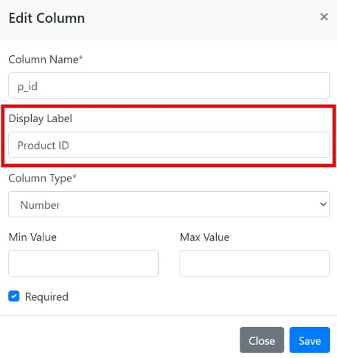

# Change Log

## 15 December 2021

### Added

* The option to transpose (switch) rows and columns in the user datasheet. This helps to accept spreadsheets having horizontal data.

### Updated

* The list type column can now accept any number of valid values. Developers can configure the values via a CSV file.
* The end users can search/select the list values from a popup.

.png>)

## 07 December 2021

### Added

* [Google Sheets data destination](https://help.csvbox.io/destinations#google-sheets)

## 26 November 2021

### Added

* [Airtable data destination](destinations/#airtable)

### Updated

* Made boolean column type case insensitive

## 14 November 2021

### Added

* [Dynamic Columns (Beta)](getting-started/sheet-options.md)

## 28 October 2021

### Added

* [PostgreSQL data destination](https://help.csvbox.io/destinations#postgresql)

### Updated

* Fixed dashboard bugs
* Fixed UI bugs of the importer
* Added Display Labels to [List Column Type](https://help.csvbox.io/validations#list).

## 11 October 2021

### Added

* Usage stats on the app dashboard

## 05 October 2021

### Added

* [Bubble integration](https://help.csvbox.io/destinations/bubble.io)

## 28 September 2021

### Added

* The display order of the columns in the importer can now be changed by simply drag-dropping in the dashboard.

* Ability to add rows directly in the importer.

* Added Column Info Hints. Info Hints are help tooltips that will get displayed when the users hover the mouse over the Column Name (or click it) in the importer. They are useful to convey additional information about the Column.

### Updated

* The settings now allow skipping of the CSV data to be stored in csvbox s3 storage.

## 15 September 2021

### Added

* Multiple Encoding support. The users can now select/change the Character Set when they upload a CSV.

* Display options for adding customizable title, help text and downloadable sample CSV on the importer.

## 09 September 2021

### Added

* VueJs integration.

### Updated

* Increased the size of the file drop area on the importer.
* Required columns will now have a \* mark on the column mapping page of the importer.

### Fixed

* Intermitted failed imports problem. It was related to the Cloudflare CDN issue.

## 31 August 2021

### Added

* 'Remove All' button to delete the invalid rows all at once.

* Big-endian validation for date type columns.

## 30 August 2021

It was been a busy month for the csvbox team as we reworked the entire architecture and introduced some new features.

### Added

* A new Plus plan with an increased limit of 500,000 rows per import

* **Intelligent Column Mapping** - Based on the historical columns mapped by the users, the importer will now automatically map the columns for new imports so that the users don't have to.
* **Matching Keywords** - You can provide a set of keywords as alternative matching options to help users match column names automatically. For example, let's say you have a column name 'First Name'. If you think a lot of your users might have sheets with columns as 'F\_Name' or simply 'First', then you can add two matching keywords 'F\_Name' and 'First'. The importer will then automatically match columns to the specified keywords to speed up column mapping.
* ****[**MySQL Data Destination**](https://help.csvbox.io/destinations#mysql-database) - Push customer CSV data directly to your MySQL Database Tables.

### **Fixed**

* UI bugs

## 26 July 2021

### Added

* In addition to the Column Name, you can now add Display Label for any sheet column. Display Labels will replace the Column Names in the header row that the user will see while doing an import.

### Changed

* Fixed Date validation bug.

## 20 July 2021

### Added

* Angular Integration

## 13 July 2021

### Added

* React Integration

## 07 July 2021

### Added

* A new **`Data`** variable is returned via the **`callback`** function of the integration code. This variable contains the details of the completed import. More information [here](https://help.csvbox.io/getting-started#callback-function). This change is backward compatible with the old integration code.

## 30 June 2021

### Changed

* Fixed UI bugs.
* Optimized importer for faster speed.

## 11 June 2021

### Added

* New column type 'List'. You can now specify a list of allowed values for a column. The importer will validate the column data with the list of values configured.
* Min, Max values validation for Number type columns.
* Min, Max character length validation option for Text type columns.

## 09 June 2021

### Added

* Multiple custom user attributes to reference the users and identify them in your platform. More info here - [https://help.csvbox.io/getting-started#referencing-the-user](https://help.csvbox.io/getting-started#referencing-the-user)

## 28 May 2021

### Added

* A sheet copy button to quickly make duplicate sheets.

## 24 May 2021

### Added

* A new optional method **setUser()** to the sheet integration code. With the **setUser()** method you can reference the user by providing the value to the **user\_id** option. This helps you identify and match imports to their respective users from within your system.

### Changed

* Updated pricing plans.

## 21 May 2021

### Added

* Support for adding custom headers for all webhooks.

## 18 May 2021

### Changed

* Fixed a few edge case data input scenarios for CSV files.
* Improved the speed of import.

## 29 April 2021

### Added

* Boolean, Regex, IP, URL, Credit Card type validations for sheet columns.

### Removed

* csvbox.io branding for paid plans.&#x20;

## 20 April 2021

### Added

* Amazon S3 destination type. You can now push the user uploaded files directly to your S3 bucket

## 12 April 2021

### Added

* Encryption for the user-uploaded files.
* Validation check for restricting files more than 15MB in size.

### Changed

* Enhancements for faster uploads

## 19 Mar 2021

### Added

* Settings page under the top right menu

* Delete Files Policy to provide an option to get all the user files deleted as soon as the upload is complete.

### Changed

* Filter UI on the Import Page

## 03 Mar 2021

### Added

* Date type validation for the sheet columns

### Fixed

* UI bugs on the importer widget

## 18 Feb 2021

### Added

* You can now subscribe to a webhook that will be triggered each time an import event is completed.

### Fixed

* CDN file caching problem.

## 10 Feb 2021

### Added

* Added a callback function to the sheet integration code. This function will be invoked client side each time an import event is completed.

## 20 Dec 2020

### Fixed

* UI errors on the Imports page.

### Changed

* Location of the plans page. Moved it under the User menu.

## 14 Dec 2020

### Added

* Introduced csvbox.io to the world

