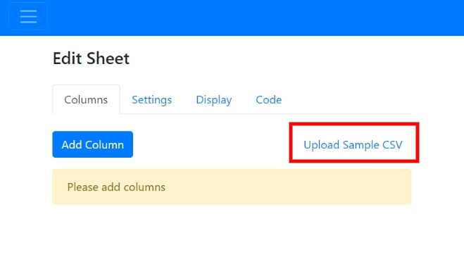

# Add Columns via CSV

When creating a sheet you have the option to add columns in bulk by uploading a CSV file.

Simply upload a sheet having data on the columns to be added and accordingly the app will create the columns in bulk. 

The following information needs to be added in the CSV:

1. [Column Name](https://help.csvbox.io/getting-started/sheet-options#column-name) (Mandatory) 
2. [Display Name](https://help.csvbox.io/getting-started/sheet-options#display-label) (Optional)
3. [Info Hint](https://help.csvbox.io/getting-started/sheet-options#info-hint) (Optional) 
4. [Column Type](https://help.csvbox.io/getting-started/sheet-options#column-type) (Optional)  
5. [Is Required](https://help.csvbox.io/getting-started/sheet-options#required) (Optional) 
6. [Keywords](https://help.csvbox.io/getting-started/sheet-options#matching-keywords) (Optional) 

