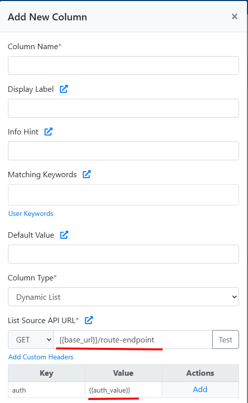

# AI Bulk Transforms


Currently in Beta


### How to Enable AI Transformations

To enable this feature for a sheet:

1. Go to your **Sheet Settings**
2. Click on the **Import Steps** tab
3. Navigate to the **Verify Data** tab
4. Set **"Enable AI Transformations?"** to **Yes**
5. Save your settings

Once enabled, a new **"Bulk Transform"** option will appear in the Verify step of the import flow for each column.

<figure><figcaption>
Bulk Transform Button
</figcaption></figure>

<figure><figcaption>
AI Bulk Transform Screen
</figcaption></figure>

### What Can It Do?

The users can use this tool to clean, format, and enrich the data effortlessly using plain language. It  can:

* Capitalize or lowercase text in `'product_name'`
* Add a 10% markup to values in `'price'`
* Translate `'description'` to Spanish
* Format `'order_date'` to `YYYY-MM-DD`
* Extract the domain name from `'email'`
* Tag rows as `'Yes'` in `'priority'` if `'notes'` mention "urgent"

These are just a few examples — the feature is flexible and can handle a wide range of transformations across different languages.

### Key Features

* Transform entire columns using simple AI prompts.
* User data never leaves the browser — values are _not_ sent to any external AI models.
* Fix validation issues quickly by modifying problematic fields in bulk.
* Users can modify or delete rows, but cannot add new rows using AI.
* Supports prompts in all languages available in the importer.
* Users can preview the data before applying changes.
