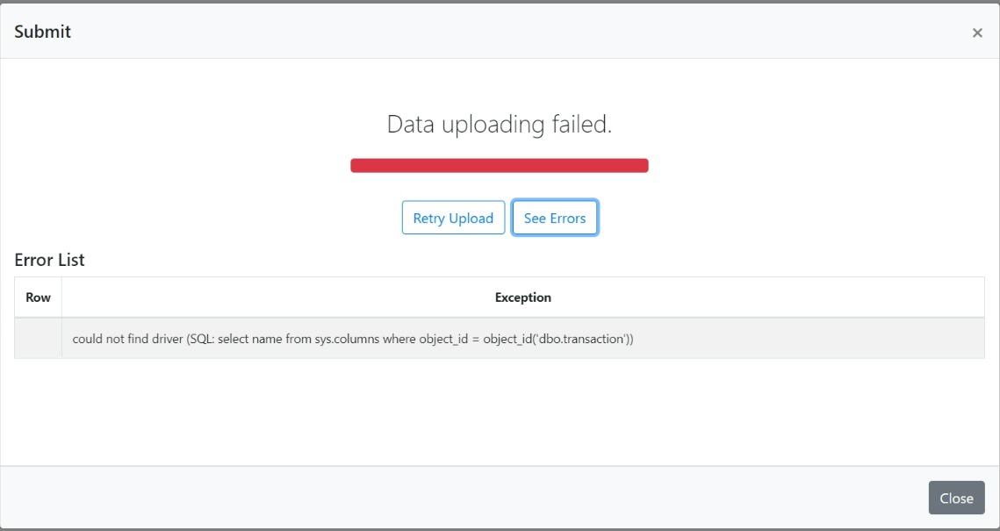
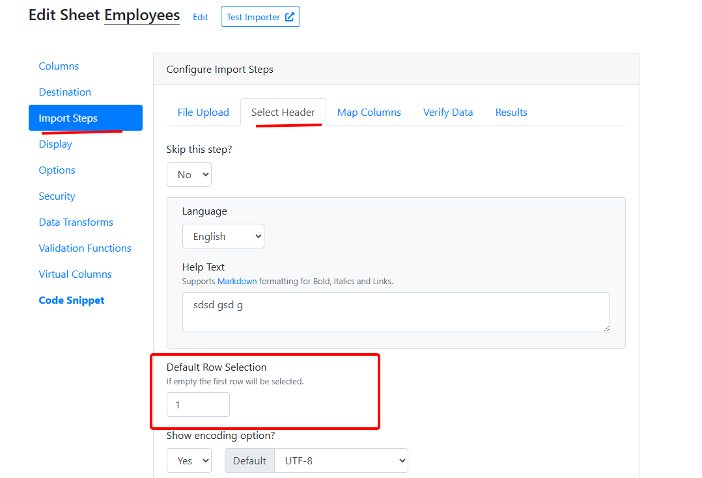

# Sheet Options

## Show Error Text

<details>

<summary>Display the import fail error messages back to the end-users.</summary>


To see the errors, the users will have to click the 'See Errors' button on the import complete screen.



</details>

## Export Button

<details>

<summary>Export validation errors in Excel</summary>

With this option, you can enable/disable the **Export** button on the verify data screen. Your users can export data to Excel while keeping the error highlighting and error messages. This helps to resolve the errors in the Excel sheet and quickly re-upload the file in CSVbox.


</details>

## Server & Data Location

<details>

<summary>Select the geographic location of the servers &#x26; database for the user data.</summary>

Data residency refers to where the data is stored in a geographical location. The location is important usually for regulatory or policy reasons.

You have the option to select the storage location of the data uploaded by your users.

Go to **Edit Sheets** > **Options** > **Privacy & Security** section > Select the location from the dropdown.


The US is the default location. The other option is Europe (Germany.)

The data uploaded by the users will then pass through servers and get stored in the database situated in the selected location only.

Note, that you also have the option to not store the data at all.

The long-lived data about the import and the user files is not covered under the selected location. It mainly consists of supplementary log data helpful for troubleshooting and analyzing the import processes. This data does not include any original data from inside the user files.\
\
The image below shows how the data will flow if you select Europe as the data residency location.


</details>

## Domain Authorization

<details>

<summary>Run the importer on select domains only</summary>

You can provide a list of authorized _domains/sub-domains_ for embedding the importer. The embedded importer will work on the whitelisted domains only.

Go to **Edit Sheets** > **Options** > **Authorized Domains** > Add the domain/subdomains


* If you do not whitelist any domain, then the importer embed will work on all the domains. This is the default configuration.
*   You can use the "\*" wildcard prefix to include any subdomain. A few examples:

    | Text              | Valid                        | Invalid                              |
    | ----------------- | ---------------------------- | ------------------------------------ |
    | exampleco.com     | exampleco.com                | www.exampleco.com, app.exampleco.com |
    | www.exampleco.com | www.exampleco.com            | exampleco.com, app.exampleco.com     |
    | app.exampleco.com | app.exampleco.com            | exampleco.com, www.exampleco.com     |
    | \*.exampleco.com  | all exampleco.com subdomains |                                      |

If a domain fails validation then the user will see the error screen as below:

</details>

## File Delete Policy

<details>

<summary><strong>Managing User Data Storage in CSVbox</strong></summary>

You have the option to either enable or disable the storage of the user uploaded data in CSVbox. This decision can be made based on privacy preferences or specific sheet requirements.


* **Do not store the file**: By enabling this option, the user-uploaded data will not be stored in the CSVbox datastore.
* **Store data**: Data will be stored on CSVbox storage. It will be auto deleted after one month.

</details>

## Import Complete Messages

<details>

<summary>Show custom messages when the import is completed</summary>

You can show customized success or failure messages when the import is complete. 

The messages can be:

1. **Static** - Any fixed text as per your requirements.
2. **Dynamic** - Provide an API to fetch the message text in real-time. The importer will append metadata (`import_id`, `sheet_id`) to the API as query parameters. This will help determine the context and return relevant messages.

</details>

## Resubmit Button

<details>

<summary>1-click to resubmit the same CSV file again</summary>

With this option, you can show or hide the Resubmit button on the Import Success screen.

The Resubmit button triggers a new import pushing the same file with the same import configuration.

This is useful during testing and debugging. You don't have to upload the file, match columns and confirm data for importing the file. Simply click the Resubmit button and push the file to the same destination.


</details>

## Importer Dialog Size

<details>

<summary>Control the size of the import dialog box for large screens</summary>

Based on your import data structure (# of columns) you can pick between two import dialog sizes:

1.  Medium

    <figure><figcaption><p>Medium size</p></figcaption></figure>
2.  Large

    <figure><figcaption><p>Large size</p></figcaption></figure>

To change the size go to sheet settings > display > Importer Dialog Size


Note: The dialog size configuration will be applicable for large (desktop) screens only. For smaller screens the dialog will always occupy the entire screen.

</details>

## Worksheet Selection

<details>

<summary>Allow users to select a worksheet for upload</summary>

There can be a case where the uploaded Excel file contains multiple worksheets. You can allow the users to select a worksheet for upload.

To activate worksheet selection go to sheet settings > display > File Upload > Select '**Yes**' for **Allow Worksheet Selection** option.


If the **Allow Worksheet Selection** option is set to '**No**' then the first worksheet will be picked up by default.

</details>

## Custom Redirect URL

<details>

<summary>Redirect end users to any page after successful import</summary>

You have the ability to specify a custom URL for redirection upon successful import completion. This enhancement is designed to provide greater flexibility and streamline your workflow by directing users to a specific page immediately after the successful import.


</details>

## Show File Upload Box

<details>

<summary>Enable / Disable the ability to upload spreadsheet files</summary>

There can be a case where you need to disable user file uploads to allow only copy-pasting of the data in CSVbox. In such cases, you can hide the File Upload Box and only show the users the Copy-Paste data option.

To hide the File Upload Box go to sheet settings > display > File Upload > Select '**No**' for '**Show File Upload Box?**' option.

</details>

## Import Description

<details>

<summary>Allow users to provide a name/description of the file they are uploading</summary>

Enable users to input a name or a description for their uploaded files. File names like "contacts.csv" or "Import 123.xlsx" lack context. More descriptive labels such as "Texas Customers" or "Parts from 2022 Catalog" enhance the clarity and utility of the import.

The description input box will be visible if enabled after the user selects the file.\
\
&#x20;

The description will be pushed along with the row data at the end destination. The data will be available in the **import\_description** property:

```
    "import_id": 79418895,
    "sheet_id": 575,
    "sheet_name": "Products234248",
    "import_description": "Product Catalogue Jan 2024", 
    "env_name": "default", 
    "destination_type": "webhook",
```

The following destinations are supported:

1. API/Webhook
2. Zapier
3. [Data at Client](../getting-started/3.-receive-data.md#data-on-the-client-side)
4. [Import Complete Webhook](../getting-started/3.-receive-data.md#import-complete-webhook)

To enable the description input box:

Go to Sheet Settings > Display Tab > Select 'File Upload' Page > Go to 'Show import description' option > Select 'Yes'


By default his feature is turned OFF.

A minimum of 3 characters and a maximum of 100 characters is required.&#x20;


</details>

## Mapping Choice

<details>

<summary>Option for customers to map file columns to template fields or template fields to file columns.</summary>

#### How It Works:

By default, on the column mapping screen:

* **Template Fields** are static and displayed on the left.
* **Uploaded File Columns** appear on the right in a dropdown, allowing users to map them to the corresponding template fields.

.png>)

With the **Mapping Choice** option, users can **reverse this mapping direction**:

* Selecting **"Template Fields"** as the Mapping Choice flips the layout.

.png>)

* **File Columns** become static on the left, while **Template Fields** appear in the dropdown on the right, allowing users to match them accordingly.

.png>)

This added flexibility helps accommodate different file structures and user preferences, making the mapping process more intuitive.


The **"Template Fields"** Mapping Choice is **not compatible** with the[ **Ignore Columns**](../advanced-installation/ignored-columns.md) functionality.


</details>

## Zero Template Columns

<details>

<summary>Accept file submissions <strong>without requiring any predefined template columns</strong></summary>

This is useful in scenarios where you want to allow users to upload files with their own structure, without enforcing a strict column format.

#### **How It Works**

* By default, CSVBox requires at least one template column for mapping.
* Configuring **"Allow Zero Template Columns"** to "Yes" lets users submit files **without any predefined template columns**, providing complete flexibility.
* This setting can be combined with the [**Unmapped Columns**](../advanced-installation/unmapped-columns.md) feature, allowing users to upload files with **any set of columns**, without the need for a predefined template structure.

 (1) (1) (1) (1).png>)

#### **When to Use This Feature**

* When you want to **fully accommodate user-defined file formats**.
* When you prefer **not to enforce a rigid template**, giving users the freedom to submit files as they are.


For this feature to work effectively, ensure that **Allow Unmapped Columns** is set to **"Yes"** along with "**Show Unmapped Columns on Validation Screen" selection.** This ensures that users can review and verify file columns before submission.


</details>

## Formatting in Excel Files

<details>

<summary>Handling Excel File Formatting: Dates, Times &#x26; Numbers</summary>

When importing data from Excel files, you may encounter unexpected issues due to the way Excel internally stores and formats different types of values—especially **Dates**, **Times**, and **Numbers**. Unlike CSV files, Excel files can retain formatting, formulas, and cell types, which can lead to inconsistencies or misinterpretation during import.

To help you gain better control over how your data is interpreted, csvbox now provides customizable options to configure the way Excel data is processed.

### Date Formatting Issues in Excel

Excel stores dates in one of two ways:

1. **As formatted text**: e.g., `"03/04/2024"`
2. **As numeric serial values**: e.g., `45025`, which represents the number of days since January 1, 1900.

This dual nature can lead to problems during import, especially when dealing with international date formats. For example:

* `"03/04/2024"` might be **March 4** in the U.S. (MM/DD/YYYY)
* ...or **April 3** in Europe (DD/MM/YYYY)

If Excel stores the date as a number (`45025`) and the importer misinterprets the format, the final result could be completely off.

To address this, csvbox lets you explicitly define how Excel date values should be interpreted:

#### **Date Handling Options**

* **Default**\
  Uses Excel’s built-in logic to interpret the cell as a date. Best for files with consistent formatting and locale.
* **MM/DD/YYYY**\
  Forces interpretation using the **Month-Day-Year** format. Example:\
  `"03/04/2024"` → March 4, 2024
* **DD/MM/YYYY**\
  Forces interpretation using the **Day-Month-Year** format. Example:\
  `"03/04/2024"` → April 3, 2024
* **Custom**\
  You can define a custom format like `YYYY-MM-DD`, `DD-MMM-YYYY`, or any other pattern based on how your Excel file stores the date.\
  Example:\
  `"12-Mar-2024"` → Use custom format `DD-MMM-YYYY`


If your dates are inconsistently formatted or include a mix of text and numeric formats, consider cleaning them in Excel first, or use the **Custom** option for better accuracy.


***

### Time Formatting Issues in Excel

Excel also allows time values to be stored either as:

* **Numeric fractions** of a day (e.g., `0.5` represents 12:00 PM)
* **Formatted time strings** (e.g., `"14:30"`, `"2:30 PM"`, `"14:30:00"`)

This can create parsing issues, especially if some cells are stored as numbers and others as formatted text. For example:

* `0.75` → might mean `6:00 PM` (75% of a day)
* `"06:00"` → clearly indicates 6 AM, but may be read as a string

To avoid misinterpretation, csvbox provides options for:

#### **Time Handling Options**

* **Default**\
  Uses Excel’s formatting as-is. Suitable for simple, clean files.
* **HH:MM:SS**\
  Example: `"14:30:00"` → 2:30 PM
* **HH:MM AM/PM**\
  Example: `"2:30 PM"` → 14:30
* **Custom**\
  Define your own time pattern like `HH:mm`, `h:mm a`, etc., based on your file’s content.

***

### Number Formatting Issues in Excel

Excel often applies formatting to numeric values that changes how they appear:

* A raw value of `0.15` could be displayed as `15%`
* A value of `1200` might appear as `$1,200.00`
* A long number like `1234567890123` may be auto-converted to scientific notation (`1.23E+12`)

These formatted displays can mislead the importer if you're expecting clean numbers.

#### **Number Interpretation Options**

* **Formatted Values**\
  Imports numbers exactly as shown in Excel. Examples:
  * `$1,200.00` stays `$1,200.00`
  * `15%` stays `15%`
  * `1.23E+12` stays in scientific notation
* **Original RAW Values**\
  Strips all formatting and imports the core numeric value. Examples:
  * `$1,200.00` → `1200`
  * `15%` → `0.15`
  * `1.23E+12` → `1230000000000`


Use RAW if you’re planning to run calculations or validations on numeric fields post-import.


***

### How to Use These Settings

When setting up your Excel-based import:

1. Navigate to the **Sheet Settings > Options** panel in your CSVbox dashboard.
2. Scroll to the **Formatting in Excel** section.
3. Choose your preferred options for:
   * **Date Format**
   * **Time Format**
   * **Number Interpretation**
4. Save the configuration.

***

These new controls ensure your data is interpreted as intended—minimizing errors and reducing the need for pre-processing in Excel before importing.

</details>

## Hide Unmapped Columns

<details>

<summary>H<strong>ide unmapped columns by default on the Verify Data Screen</strong></summary>

You can choose to **hide unmapped columns by default** on the **Verify Data** screen of the importer. This helps keep the interface clean and focused, showing only the important fields to the user.

**How it works**

* When enabled, columns in the uploaded CSV that are **not mapped** will be **hidden** on the Verify Data screen.
* Columns marked as **Required** will always remain visible.
* Even though these unmapped columns are hidden from view, their data will still be **pushed to the destination** exactly as before.
* This makes it easier for users to review and verify only the relevant columns before submission.

**Settings**

* **Option name:** Hide columns that are not mapped
* **Default value:** No
* **Available values:** Yes / No
* Set it to **Yes** to hide unmapped columns.

<figure><figcaption></figcaption></figure>

</details>


