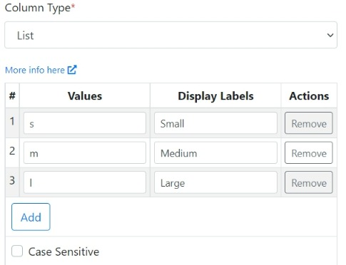

# Validations

## Column Data Types

While creating a sheet you can specify the column to be any of the data types mentioned below. If the incoming CSV data does not match the column data type (and its validation rules), then the user will see a relevant error message identifying what the problem is and how to fix it. &#x20;

### Text

This is the default column data type. It accepts any alphanumeric string. You can provide the `Min Length` and `Max Length` parameters to specify the acceptable length of the text data.

### Number

This **Number** column data type accepts integer and float strings only. Additionally, you can provide the `Min Value` and `Max Value` parameters to specify the acceptable range of numbers.

### Email

The column under validation must be formatted as an email address.

### Date

The column under validation must be formatted as a date. You have to select a `Date Format` from the dropdown list to specify the acceptable format. The default format is '_MM/DD/YYYY_'. If your desired format is not found in the list, you can simply provide your custom format using the formatting tokens below.

|                                | Token              | Output                                                                                                                                                                                                                                                                                                                                     |
| ------------------------------ | ------------------ | ------------------------------------------------------------------------------------------------------------------------------------------------------------------------------------------------------------------------------------------------------------------------------------------------------------------------------------------ |
| **Month**                      | M                  | 1 2 ... 11 12                                                                                                                                                                                                                                                                                                                              |
|                                | Mo                 | 1st 2nd ... 11th 12th                                                                                                                                                                                                                                                                                                                      |
|                                | MM                 | 01 02 ... 11 12                                                                                                                                                                                                                                                                                                                            |
|                                | MMM                | Jan Feb ... Nov Dec                                                                                                                                                                                                                                                                                                                        |
|                                | MMMM               | January February ... November December                                                                                                                                                                                                                                                                                                     |
| **Quarter**                    | Q                  | 1 2 3 4                                                                                                                                                                                                                                                                                                                                    |
|                                | Qo                 | 1st 2nd 3rd 4th                                                                                                                                                                                                                                                                                                                            |
| **Day of Month**               | D                  | 1 2 ... 30 31                                                                                                                                                                                                                                                                                                                              |
|                                | Do                 | 1st 2nd ... 30th 31st                                                                                                                                                                                                                                                                                                                      |
|                                | DD                 | 01 02 ... 30 31                                                                                                                                                                                                                                                                                                                            |
| **Day of Year**                | DDD                | 1 2 ... 364 365                                                                                                                                                                                                                                                                                                                            |
|                                | DDDo               | 1st 2nd ... 364th 365th                                                                                                                                                                                                                                                                                                                    |
|                                | DDDD               | 001 002 ... 364 365                                                                                                                                                                                                                                                                                                                        |
| **Day of Week**                | d                  | 0 1 ... 5 6                                                                                                                                                                                                                                                                                                                                |
|                                | do                 | 0th 1st ... 5th 6th                                                                                                                                                                                                                                                                                                                        |
|                                | dd                 | Su Mo ... Fr Sa                                                                                                                                                                                                                                                                                                                            |
|                                | ddd                | Sun Mon ... Fri Sat                                                                                                                                                                                                                                                                                                                        |
|                                | dddd               | Sunday Monday ... Friday Saturday                                                                                                                                                                                                                                                                                                          |
| **Day of Week (Locale)**       | e                  | 0 1 ... 5 6                                                                                                                                                                                                                                                                                                                                |
| **Day of Week (ISO)**          | E                  | 1 2 ... 6 7                                                                                                                                                                                                                                                                                                                                |
| **Week of Year**               | w                  | 1 2 ... 52 53                                                                                                                                                                                                                                                                                                                              |
|                                | wo                 | 1st 2nd ... 52nd 53rd                                                                                                                                                                                                                                                                                                                      |
|                                | ww                 | 01 02 ... 52 53                                                                                                                                                                                                                                                                                                                            |
| **Week of Year (ISO)**         | W                  | 1 2 ... 52 53                                                                                                                                                                                                                                                                                                                              |
|                                | Wo                 | 1st 2nd ... 52nd 53rd                                                                                                                                                                                                                                                                                                                      |
|                                | WW                 | 01 02 ... 52 53                                                                                                                                                                                                                                                                                                                            |
| **Year**                       | YY                 | 70 71 ... 29 30                                                                                                                                                                                                                                                                                                                            |
|                                | YYYY               | 1970 1971 ... 2029 2030                                                                                                                                                                                                                                                                                                                    |
|                                | YYYYYY             | <p>-001970 -001971 ... +001907 +001971<br><strong>Note:</strong> <a href="https://tc39.es/ecma262/#sec-expanded-years">Expanded Years</a> (Covering the full time value range of approximately 273,790 years forward or backward from 01 January, 1970)</p>                                                                                |
|                                | Y                  | <p>1970 1971 ... 9999 +10000 +10001<br><strong>Note:</strong> This complies with the ISO 8601 standard for dates past the year 9999</p>                                                                                                                                                                                                    |
| **Era Year**                   | y                  | 1 2 ... 2020 ...                                                                                                                                                                                                                                                                                                                           |
| **Era**                        | N, NN, NNN         | <p>BC AD<br><strong>Note:</strong> Abbr era name</p>                                                                                                                                                                                                                                                                                       |
|                                | NNNN               | <p>Before Christ, Anno Domini<br><strong>Note:</strong> Full era name</p>                                                                                                                                                                                                                                                                  |
|                                | NNNNN              | <p>BC AD<br><strong>Note:</strong> Narrow era name</p>                                                                                                                                                                                                                                                                                     |
| **Week Year**                  | gg                 | 70 71 ... 29 30                                                                                                                                                                                                                                                                                                                            |
|                                | gggg               | 1970 1971 ... 2029 2030                                                                                                                                                                                                                                                                                                                    |
| **Week Year (ISO)**            | GG                 | 70 71 ... 29 30                                                                                                                                                                                                                                                                                                                            |
|                                | GGGG               | 1970 1971 ... 2029 2030                                                                                                                                                                                                                                                                                                                    |
| **AM/PM**                      | A                  | AM PM                                                                                                                                                                                                                                                                                                                                      |
|                                | a                  | am pm                                                                                                                                                                                                                                                                                                                                      |
| **Hour**                       | H                  | 0 1 ... 22 23                                                                                                                                                                                                                                                                                                                              |
|                                | HH                 | 00 01 ... 22 23                                                                                                                                                                                                                                                                                                                            |
|                                | h                  | 1 2 ... 11 12                                                                                                                                                                                                                                                                                                                              |
|                                | hh                 | 01 02 ... 11 12                                                                                                                                                                                                                                                                                                                            |
|                                | k                  | 1 2 ... 23 24                                                                                                                                                                                                                                                                                                                              |
|                                | kk                 | 01 02 ... 23 24                                                                                                                                                                                                                                                                                                                            |
| **Minute**                     | m                  | 0 1 ... 58 59                                                                                                                                                                                                                                                                                                                              |
|                                | mm                 | 00 01 ... 58 59                                                                                                                                                                                                                                                                                                                            |
| **Second**                     | s                  | 0 1 ... 58 59                                                                                                                                                                                                                                                                                                                              |
|                                | ss                 | 00 01 ... 58 59                                                                                                                                                                                                                                                                                                                            |
| **Fractional Second**          | S                  | 0 1 ... 8 9                                                                                                                                                                                                                                                                                                                                |
|                                | SS                 | 00 01 ... 98 99                                                                                                                                                                                                                                                                                                                            |
|                                | SSS                | 000 001 ... 998 999                                                                                                                                                                                                                                                                                                                        |
|                                | SSSS ... SSSSSSSSS | 000\[0..] 001\[0..] ... 998\[0..] 999\[0..]                                                                                                                                                                                                                                                                                                |
| **Time Zone**                  | z or zz            | <p>EST CST ... MST PST<br><strong>Note:</strong> as of <strong>1.6.0</strong>, the z/zz format tokens have been deprecated from plain moment objects. <a href="https://github.com/moment/moment/issues/162">Read more about it here.</a> However, they *do* work if you are using a specific time zone with the moment-timezone addon.</p> |
|                                | Z                  | -07:00 -06:00 ... +06:00 +07:00                                                                                                                                                                                                                                                                                                            |
|                                | ZZ                 | -0700 -0600 ... +0600 +0700                                                                                                                                                                                                                                                                                                                |
| **Unix Timestamp**             | X                  | 1360013296                                                                                                                                                                                                                                                                                                                                 |
| **Unix Millisecond Timestamp** | x                  | 1360013296123                                                                                                                                                                                                                                                                                                                              |


For example, specifying a token string **`dddd, MMMM Do YYYY, h:mm:ss`**  will require the date to be in the format **`Sunday, February 14th 2010, 3:25:50 pm`.**


### Boolean

The column under validation must be able to be cast as a boolean. Accepted inputs are _true_, _false_, _TRUE_, _FALSE_, _1_, _0_, _yes_, _no_, _y_, _n_, _on_, _off_, _enabled,_ and _disabled_.

### Regex

The column data must match the given regular expression. You need to specify the `Regex` and the importer will pattern match it with the incoming data.&#x20;

### IP

The column under validation must be an IP address. You have to select the `IP Version`.

### URL

The column under validation must be a valid URL.

### Credit Card

The column under validation must be formatted as a credit card number. Acceptable formats are _5555555555554444_, _5555-5555-5555-4444_ and _5555 5555 5555 4444_.

### List

With the **List** data type, you can specify a list of acceptable values. The importer will compare the CSV column data with the list of acceptable values and throw a validation error if there is a mismatch. You can specify a list of acceptable `Values` and related `Display Labels`. The importer will match the column data with the list of `Display Labels`. If the data passes validation then the `Values` corresponding to the `Display Labels` will be pushed to the destination. For example say, you configure the List column as shown below:



In this case, the acceptable data in the CSV column will be _Small_, _Medium_, and _Large_. Based on the actual data found in the user CSV, the values _s_, _m_ or _l_ will be pushed to your data destination. This allows you to accept readable values from your users while pushing data to your system that is in a format it understands.

### Dynamic List

This is similar to the **List** type column above where the importer will validate the column data against a list of values. However, instead of providing a static list of values, with the **Dynamic List** column type, you can now specify a list of acceptable values in real-time via an API.

The API should return the list of values in the JSON format as shown below.&#x20;

```json
[
   {"value": "uk", "display_label": "England"},
   {"value": "us", "display_label": "United States"},
   {"value": "au", "display_label": "Australia"}
]
```

For each list item, the `value` field is mandatory while `display_label` is optional.

## Other Validation Options

### Column Required

You can check/uncheck the `Required` checkbox on the Column Settings window. The column data must be present, and not empty if the `Required` checkbox is ticked.
