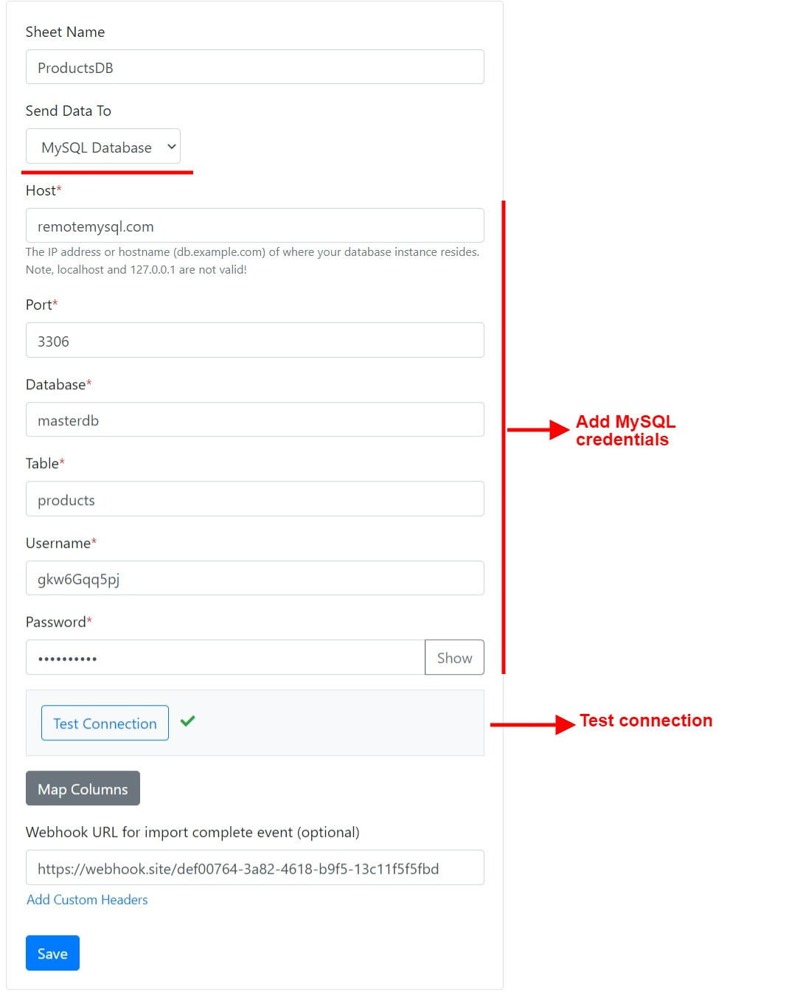
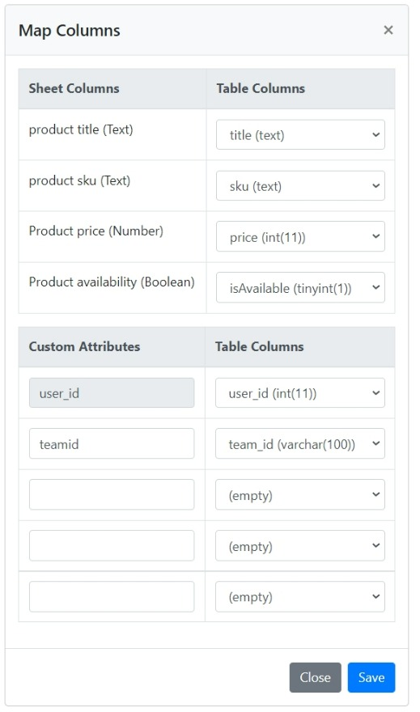
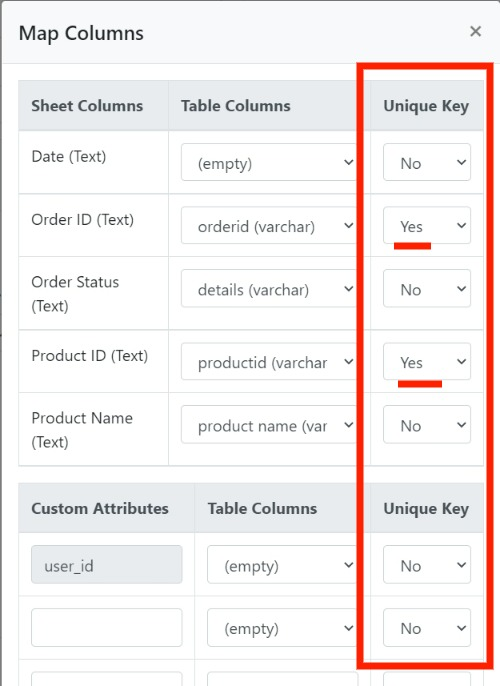

# Data Destinations

1. [None](./#none)
2. [API](./#api-webhook)
3. [Amazon S3](./#amazon-s3)
4. [MySQL](./#mysql-database)
5. [PostgreSQL](./#postgresql)
6. [SQL Server ](./#sql-server)
7. [Google Sheet](./#google-sheets)
8. [FTP Server](./#ftp-server)
9. [Bubble.io](./#bubble)
10. [Airtable](./#airtable)
11. [Zapier](./#zapier)
12. [Notion](./#notion)
13. [Webflow](./#webflow)


At a time only one destination can be selected per sheet.


## None

The user-uploaded data will not be pushed anywhere. The files will be, however, available for download via the csvbox.io admin.

## API / Webhook

The data will be pushed to a webhook endpoint as configured in the sheet settings. You can choose between JSON, XML, and FORM Data formats for receiving data to your webhook. The data will be pushed in chunks of rows. The number of rows per chunk can be configured in the sheet settings.

#### Sample JSON POST to your API:

```javascript
[
  {
    "import_id": 79418895,
    "sheet_id": 55,
    "sheet_name": "Products",
    "row_number": 1,
    "total_rows": 5,
    "env_name": "default", 
    "original_filename": "products01_24.csv",
    "row_data": {
          "Name": "TP-Link TL-WN822N Wireless N300 High Gain USB Adapter",
          "SKU": "AS-100221",
          "Price": "33.00",
          "Quantity": "3",
          "Image URL": "https://cdn.shopify.com/s/files/1/1491/9536/products/31jJOj1DS5L_070b4893-b7af-482f-8a15-d40f5e06760d.jpg?v=1521803806"
    },
    "custom_fields": {
      "user_id": "1a2b3c4d5e6f",
      "team_id": "sales2"
    }
  },
  {
    "import_id": 79418895,
    "sheet_id": 55,
    "sheet_name": "Products",
    "row_number": 2,
    "total_rows": 5,
    "env_name": "default", 
    "original_filename": "products01_24.csv",
    "row_data":{
          "Name": "EPower Technology EP-600PM Power Supply 600W ATX12V 2.3 Single 120mm Cooling Fan Bare",
          "SKU": "AS-103824",
          "Price": "95.35",
          "Quantity": "8",
          "Image URL": "https://cdn.shopify.com/s/files/1/1491/9536/products/71pRC5VjF-L_8f840eb9-6a47-407f-999c-490f7814159d.jpg?v=1521803806"
        },
    "custom_fields": {
      "user_id": "1a2b3c4d5e6f"
      "team_id": "sales2"
    }
  },
]
```


The data will come in as HTTP POST requests. Each request will have an array of rows based on the chunk size defined in the sheet settings. You can set the chunk size to 1 to receive 1 record per HTTP request.

If the row count is greater than 10,000 then the chunk size will default to 1000. A large row count having a small chunk size increases the processing time significantly.


#### Request Type

To push the data to the destination the webhook can be called in two modes:

1. **Sequential** - Webhook APIs will be invoked in a sequential order one after another.
2. **Parallel** (Default) - Multiple webhook APIs will be invoked concurrently. It means your application will receive chunks of rows in parallel. This method reduces overall import time. However, your application will need to manage the order of data based on the row\_number attribute.

If you want to jump in and get started, we recommend testing using [webhook.site](https://webhook.site), to get your webhook URL. For testing on your local machine, we recommend using [ngrok](https://ngrok.com/).

## Amazon S3

The files uploaded by the users can be pushed to the AWS S3 Bucket of your choice. You simply need to select the destination type as 'Amazon S3' and provide the AWS credentials, bucket/folder name, and access policy for storing the files.


The data will be stored as S3 objects with the name **\{{import\_id\}}\_\{{user\_id\}}.csv** where **user\_id** is the custom user attribute that you reference via the **`setUser`**method while installing the importer code. The other 4 custom user attributes will be saved as the [user-defined metadata](https://docs.aws.amazon.com/AmazonS3/latest/userguide/UsingMetadata.html) of the S3 object.


The AWS credentials need the following 3 minimum policies for uploading files to S3:

1. _ListBucket_ policy is required for testing the connection.
2. _PutObject_ is required to add objects to S3.
3. _PutObjectTagging_ is required to add the tags (metadata) to the uploaded objects.

#### S3 Data Type

You have the option to store the data in S3 in either CSV or JSON format.&#x20;

## MySQL

Import CSV files and Excel sheets directly into your MySQL tables. How it works:

* Select the destination type as 'MySQL Database'.
* Connect your MySQL database by providing the credentials.
* Specify table name where you want the data to be pushed.

<div align="left">



</div>

* Map sheet columns to the table column.
* You can also map custom attributes to table columns.

<div align="left">



</div>

The user CSV data will then be directly be appended to the MySQL table.

## SQL Server

Import CSV files and Excel sheets directly into your SQL Server tables. How it works:

* Select the destination type as 'SQL Server Database'.
* Connect your SQL Server database by providing the credentials.
* Specify the table name where you want the data to be pushed.
* Click the 'Test Connection' button.
* If the connection is successful, then click the 'Map Columns' button and match the sheet template columns to the SQL Server table columns.
* You can also map custom attributes to table columns.
* Select between the following 2 operations:
  * **Insert** - The importer will always push the incoming CSV data as new records in the database.
  * **Upsert** - The importer will check if the record exists in the database. If the record exists, then it will be updated with the incoming data from the CSV. If the record does not exist, then a new record will be inserted. The record check will be done based on the index keys specified in the mapping modal.

<div align="center">



</div>


The **Upsert** operation will be significantly slower than the **Insert** operation. For the **Insert** operation, the records can be pushed in chunks. Whereas for the **Upsert** operation only one record can be processed at a time, and it requires multiple queries.


## Google Sheets

Import CSV files and Excel sheets directly into [Google Sheets](https://www.google.co.in/sheets/about/). Here is how it works:

* Select the destination type as 'Google Sheets'.
* Connect your Google account by clicking the Google button and accepting the relevant permissions.


The importer requires permission to view the list of Google sheets in your account and edit sheet data.


* Provide the Google sheet name.
* Specify the worksheet name where you want the data to be pushed.
* Map the template columns to the Google sheet columns.
* You can also map custom attributes to sheet columns.

The user CSV data will then be directly be added to the Google sheet.

## Bubble

Import user CSV files and Excel sheets directly into your Bubble app. More information [here](bubble.io.md).

## Notion

Import user CSV files and Excel sheets directly into your Notion databases. More information [here](notion.md).

## PostgreSQL

Import CSV files and Excel sheets directly into your PostgreSQL tables. How it works:

* Select the destination type as 'PostgreSQL'.
* Connect your PostgreSQL database by providing the credentials.
* Specify the table name where you want the data to be pushed.

<div align="left">


</div>

* Map sheet columns to the table column.
* You can also map custom attributes to table columns.

<div align="left">


</div>

The user CSV data will then be directly be appended to the PostgreSQL table.

## Airtable

Import CSV files and Excel sheets directly into your [Airtable](https://airtable.com/). Here is how it works:

* Select the destination type as 'Airtable'.
* Connect your Airtable by providing the credentials.


Steps to get the Airtable API Key are mentioned [here](https://support.airtable.com/hc/en-us/articles/219046777-How-do-I-get-my-API-key-).

Steps to get the Base ID are mentioned [here](https://support.airtable.com/docs/finding-airtable-ids#finding-ids-in-airtable-api).


* Specify the table name where you want the data to be pushed.
* Map sheet columns to the Airtable table column.
* You can also map custom attributes to table columns.

The user CSV data will then be directly appended to the Airtable table.


The data fields from the Airtable will be available in the Map Column modal only if they have **data in the first row**. You may add dummy data for each data field in the first row in order for them to appear in the Map Column modal.


There are 2 operations available for Airtable:

#### 1. Insert

Creates a new row in the table.

#### 2. Upsert

Update an existing row if a specified value already exists in a table, and insert a new row if the specified value doesn't already exist.

The column to check for uniqueness needs to be selected in the Column Mapping popup.


* If zero matches are found, a new row will be created.
* If one match is found, that row will be updated.
* **If multiple matches are found, the request will fail.**

## Zapier

Import user CSV files and Excel sheets to Zapier. More information [here](zapier.md).

## Webflow <a href="#webflow" id="webflow"></a>

Import user CSV files and Excel sheets to Webflow. More information [here](zapier.md).

## FTP Server

The files uploaded by the users can be pushed to your FTP Server. You simply need to select the destination type as 'FTP' and provide the conenction details and the folder name for storing the files.


The data will be stored as CSV files with the name **\{{import\_id\}}\_\{{user\_id\}}.csv** where **user\_id** is the custom user attribute that you reference via the **`setUser`**method while installing the importer code.

