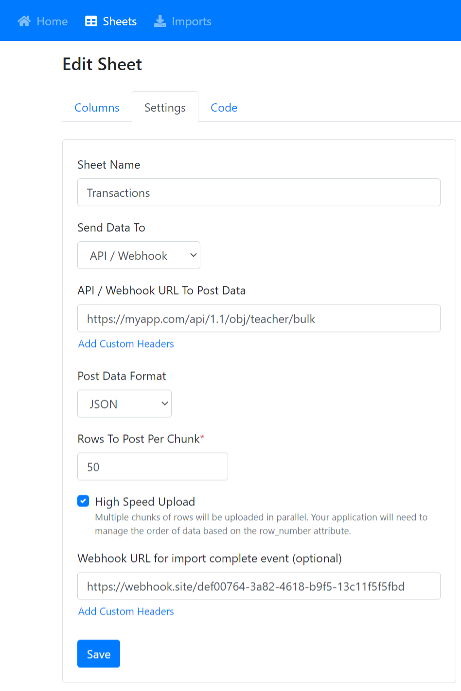
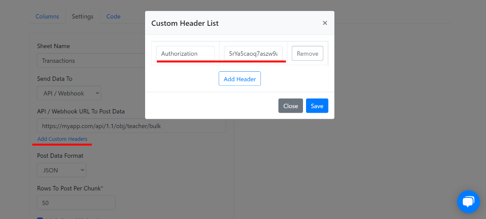

# Bubble.io

## Demo App

See how it works [here](https://csvbox-demo.bubbleapps.io/version-test).

## 1. Setting up csvbox.io

Log in to [csvbox.io](https://app.csvbox.io/login).

Add a sheet.


Add columns to the sheet. The column names should match column/attribute names for your database object in Bubble. Make sure you pay attention to upper and lower case letters on Bubble and match them in csvbox.io.


Under the "**Sheets**" section, for the "**Send Data To**" setting select the "**API/Webhook**" option. 

For the "**API / Webhook URL To Post Data**", input box type/paste a matching URL using the [Bubble.io Bulk Create API](https://bubble.io/reference#API.get_api.bulk_create). Few examples:

```text
// This is the base template Bubble.io gives
https://appname.bubbleapps.io/api/1.1/obj/typename/bulk

// Let's say you have an app named 'photo-test', and the Bubble.io database object is 'teacher', and you want to import for your TEST/DEVELOPMENT app environment. The URL should look like this.
https://photo-test.bubbleapps.io/version-test/api/1.1/obj/teacher/bulk

// Let's say you have an app named 'photo-test', and the Bubble.io database object is 'teacher', and you want to import for your PRODUCTION/LIVE app environment. The URL should look like this.
https://photo-test.bubbleapps.io/api/1.1/obj/teacher/bulk

// Let's say you your own domain 'myapp.com', and the Bubble.io database object is 'teacher', and you want to import for your TEST/DEVELOPMENT app environment. The URL should look like this.
https://myapp.com/version-test/api/1.1/obj/teacher/bulk

// Let's say you your own domain 'myapp.com', and the Bubble.io database object is 'teacher', and you want to import for your PRODUCTION/LIVE app environment. The URL should look like this.
https://myapp.com/api/1.1/obj/teacher/bulk
              
```

Select "**JSON**" as the "**Post Data Format**".

In the "**Rows To Post Per Chunk**" field enter "50" to start. Your Bubble.io plan will dictate how many records you will want to post at once. 



Click the "**Save**" button.

#### Add custom headers:

On the same page, under "**API / Webhook URL To Post Data**" click the link "**Add Custom Headers**".

Add a new request header.

For the "**Key 1**" field type: **Authorization**

For the "**Value 1**" field type: "**Bearer** _**{your API key}".**_ Replace {your API key} with the API key you get from Bubble.io for your app. 



Click the "**Save**" button.


You can find your API key by going to your Bubble app on Bubble.io. Click the gear icon labeled "**Settings**" on the left side of the page &gt; then click "**API**" in the top tabs.

Under the section "**API Tokens**" click to generate a new API token. Once that token is generated paste it back into your csvbox.io request header "**Value 1**".



In your Bubble.io app settings, in the "**API**" area, make sure you have all checkboxes checked for exposing the Data API and also checked for every database object you want to import for.


Go to the "**Code**" section and note down the **Sheet License Key**.


## 2. Setting up Bubble

Install the [csvbox.io](https://bubble.io/plugin/csv--excel-importer-%7C-receive-json-1628686647935x372170116910546940) plugin to your Bubble app.

Drag the CSVBox Button element on your web page.

Save the **Sheet License Key** value from the sheet "**Code**" page \(that we saved above\) into the "**Sheet License Key**" property of the CSVBox element.


Enter the import button label under the '**button\_text**' property. Optionally you can add CSS classes in the "**button\_classes**" property to stylize the csvbox.io import button.


You can add custom user attributes \(such as user\_id, user name, company name, etc\) as values to the custom\_attribute_XX_ properties of the CSVBox Button element. More information on custom attributes is available [here](https://help.csvbox.io/getting-started#referencing-the-user).


The csvbox.io import button should be available on your app. Your users can click the button to upload CSV files. You will get data in your Bubble Database.

The CSVBox Button element exposes two events that indicate the completion of the import process. The two events are:

1. **import\_success** - triggered when the CSV data gets imported successfully into your Bubble database.
2. **import\_fail** - triggered when the import failed completely or partially failed.


You can add relevant actions to process the import result events.

## Why do I have some of my records fail with 524 errors when posting to Bubble.io Bulk Create API?

The number of records being POSTed per chunk being imported is too large for your Bubble.io monthly plan.

The higher your Bubble.io monthly plan value, the more records you can post in each chunk to the Bulk Create API that Bubble exposes.

Please follow the chunk size guidelines below for how many records you should try posting per plan.

More details: The Bubble.io Bulk Create API receives a number of records per call. If you POST too many records in each call Bubble will time out and return a 524. They will not say how many records import and how many fail. Often we found Bubble will import some but not all. The safest thing to do is follow the recommendations below.

## What 'rows to post per chunk' should I choose for my Bubble.io plan?

* Hobby/Free plan: 50
* Personal plan: 150
* Professional: Try testing some imports and find a value over 150 where it will not fail any records.
* Production: Try testing some imports and find a value over 200 where it will not fail any records.

## Why does my upload fail with unknown column name errors?

Bubble.io databases are very picky. The Column Names you are POSTing from the csvbox importer need to **EXACTLY** match what is in your Bubble.io database.

Check the following things:

* Make sure there are no extra columns in your csvbox.io sheet that do NOT map to a column/attribute in your Bubble.io database object. Bubble does not like extra columns that its database doesn't know about.
* The csvbox.io sheet column names should **EXACTLY** match the column names in your Bubble.io database object. Verify that capitalization and spaces are exactly the same as your Bubble.io database object.
* In your Bubble.io app settings, click "API" and make sure you have all checkboxes checked for exposing the Data API and also checked for every database object you want to import for.

