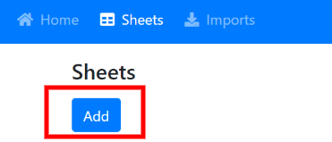
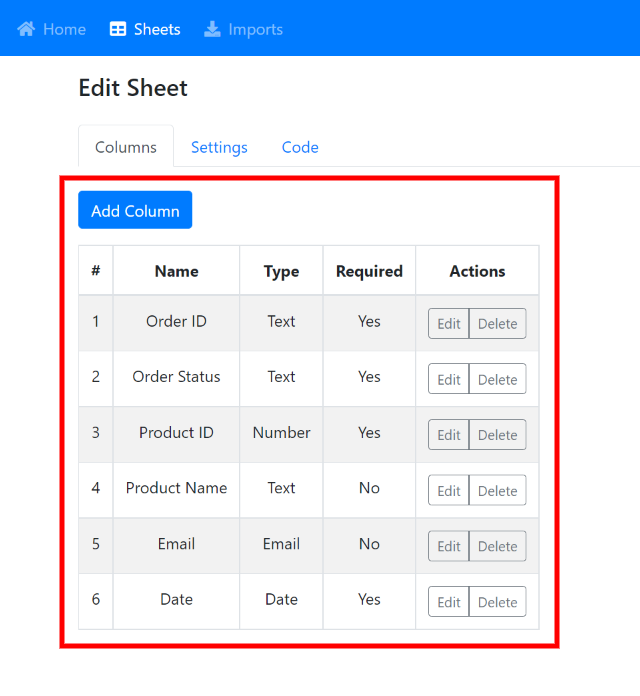
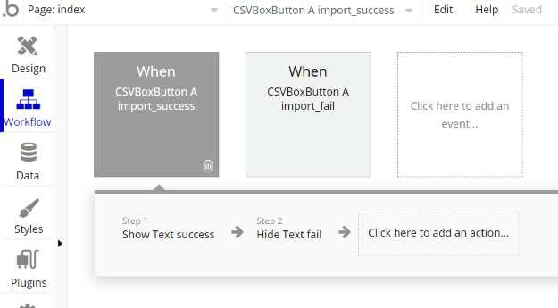

# Bubble.io

## Demo App

See how it works [here](https://csvbox-demo.bubbleapps.io/version-test).

## 1. Configuring Bubble App


You need to be on a [paid Bubble application plan](https://bubble.io/pricing/compare) to be able to use the Bubble API that is required to push external CSV data into the Bubble data store.


#### Data Settings

Create or update a data type in your Bubble app where you want to push the CSV data. Ensure that the data type is 'Publicly visible'. Add custom fields to the data type as per your requirements.

**Important:** Manually add at least one object (row) to the data type.

#### API Settings

1. Go to Settings
2. Go to the API page
3. Activate 'Data API'
4. Activate API for the data type where you want to push the CSV data
5. Generate and save the **API Private Key**

## 2. Setting up csvbox.io

Log in to [csvbox.io](https://app.csvbox.io/login).

Add a sheet.

Add columns to the sheet. The column names should match column/object names for your data type in Bubble. Make sure you pay attention to upper and lower case letters on Bubble and match them in csvbox.io.

Under the "**Settings**" section, for the "**Send Data To**" setting select the "**Bubble.io**" option.&#x20;

Fill in the following fields:

* **App Name** - This is the name of your Bubble.io app.
* **Custom Domain Name** - If you have attached a custom domain name to your Bubble app then you need to provide it here.
* **Environment** - Pick an environment between TEST/DEVELOPMENT and PRODUCTION/LIVE where you want the CSV data to be sent.
* **API Private Key** - It is the API token that you generated while configuring the [API settings ](https://help.csvbox.io/destinations/bubble.io#api-settings)in the Bubble app.
* **Data Type** - The data type name where you want to push the CSV data.

Click the "**Test Connection**" button. It should be successful if all fields are inputted correctly.

Click the "**Map Columns**" button. It will open a modal where you can map the sheet columns to the object fields.

.jpg>)

Click the "**Save**" button.

Go to the "**Code**" section of the sheet and note down the **Sheet License Key**.

## 3. Adding the csvbox to Bubble

Install the [csvbox.io](https://bubble.io/plugin/csv--excel-importer-|-receive-json-1628686647935x372170116910546940) plugin to your Bubble app.

Drag the CSVBox Button element on your web page.

Save the **Sheet License Key** value from the sheet "**Code**" page (that we saved above) into the "**Sheet License Key**" property of the CSVBox element.

Enter the import button label under the '**button\_text**' property. Optionally you can add CSS classes in the "**button\_classes**" property to stylize the csvbox.io import button.


You can add custom user attributes (such as user\_id, user name, company name, etc) as values to the custom\_attribute_XX_ properties of the CSVBox Button element. More information on custom attributes is available [here](https://help.csvbox.io/getting-started#referencing-the-user).


The csvbox.io import button should be available on your app. Your users can click the button to upload CSV files. You will get data in your Bubble Database.

The CSVBox Button element exposes two events that indicate the completion of the import process. The two events are:

1. **import\_success** - triggered when the CSV data gets imported successfully into your Bubble database.
2. **import\_fail** - triggered when the import failed completely or partially failed.

You can add relevant actions to process the import result events.

## Why does my upload fail with unknown errors?

Bubble.io databases are very picky. The Column Names you are POSTing from the csvbox importer need to **EXACTLY** match what is in your Bubble.io database.

Check the following things:

* Make sure there are no extra columns in your csvbox.io sheet that do NOT map to a field/attribute in your Bubble.io database object. Bubble does not like extra columns that its database doesn't know about.
* The csvbox.io sheet column names should **EXACTLY** match the type names in your Bubble.io database object. Verify that capitalization and spaces are exactly the same as your Bubble.io data type object.
* In your Bubble.io app settings, click "API" and make sure you have all checkboxes checked for exposing the Data API and also checked for every database object you want to import for.
