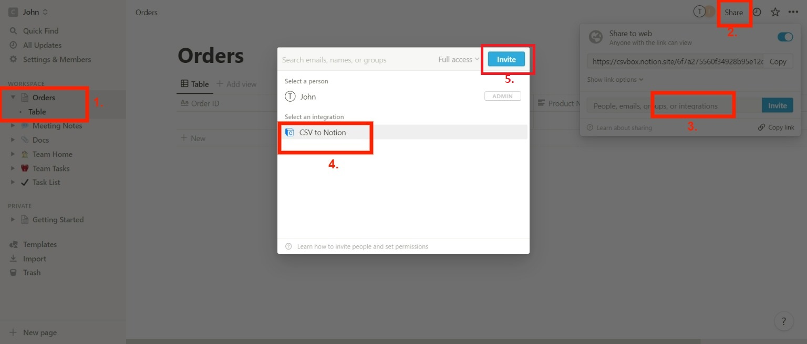

# Notion


coming soon


### Steps to configure Notion data destination:

Log in to [csvbox.io](https://app.csvbox.io/login).

Add a sheet.

Add columns to the sheet as per your requirement.

.png>)

Under the "**Destination**" section, for the "**Send Data To**" setting select the "**Notion**" option.

Click the "**Connect Notion**" button.

.png>)

This will redirect you to the Notion Integration Authorization screen.&#x20;

.png>)

You will have to select the page and the relevant workspace where you want the CSV data to be pushed.

.png>)

Click '**Allow access**'.

Login to your Notion account.

Go to your workspace where you want to receive the CSV data.

Click the "**Share"** button (top right of the dashboard.) Share the workspace with the '**CSV to Notion**' integration.


Only after sharing the workspace with the CSV to Notion integration, the Notion database will be visible in the Csvbox dashboard.


Go back to your Csvbox sheet and pick the Notion database from the list.

.png>)

Click the "**Map Columns**" button and map the sheet columns to the Notion database columns.

.png>)

Click the "**Save**" button.

The CSVs uploaded by the users will now be pushed to the Notion database.

