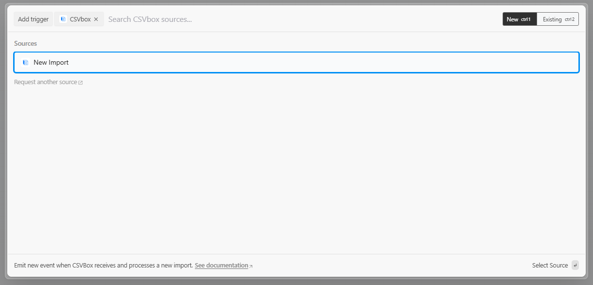

# Pipedream

This integration lets you trigger Pipedream automations in real time whenever a spreadsheet import is submitted — perfect for connecting data to your APIs, CRMs, or databases without writing custom code.

***

#### How It Works

CSVBox sends the imported CSV data to your selected Pipedream workflow as soon as a user submits it. Each import becomes a new event in Pipedream, where you can process or forward the data to hundreds of apps.

***

#### Example workflow:

1. User uploads CSV → CSVBox validates and sends data to Pipedream
2. Pipedream trigger receives the event
3. The workflow inserts rows into a database, sends Slack alerts, or posts data to your API

***

#### Setup Instructions

**Step 1: Choose Pipedream as your destination**

In your CSVBox **Sheet Settings**, select **Pipedream** as the destination and click **Save**.

**Step 2: Create a Pipedream trigger**

1. Log in to your [Pipedream account](https://pipedream.com/).
2. Create a **new workflow**.
3. When prompted to select a trigger source, choose **CSVBox > New Import**.

<figure><figcaption></figcaption></figure>

**Step 3: Connect CSVBox to Pipedream**

In the trigger setup screen, paste your **CSVBox API Key** and **API Secret Key**. You can find these under **CSVBox Dashboard → Account Settings → API Keys**.

<figure><figcaption></figcaption></figure>

**Step 4: Select your Sheet**

In the **Trigger Settings** window in Pipedream, choose the **Sheet Name** you want to connect from the dropdown.\
Click **Save and contine** to confirm.\

<figure><figcaption></figcaption></figure>

**Step 5: Verify the connection**

Return to **CSVBox → Sheet Settings → Destination**.\
The **Pipedream Connection** should now show as **successful**.\

<figure><figcaption></figcaption></figure>

**Step 6: Test the importer**

* Upload a sample CSV using your importer.
* Pipedream will instantly receive the data as an event payload.
* You can view the incoming event in your Pipedream workflow’s **Event** tab.


After making changes in your Pipedream workflow (such as reconnecting CSVBox or editing the trigger), wait for **a few seconds** before testing from CSVBox. It can take a short time for Pipedream to **propagate configuration updates** across their servers.


***

#### Common Use Cases

* **Sync leads to your CRM** (HubSpot, Salesforce, Pipedrive, etc.)
* **Insert or update records** in databases (PostgreSQL, MySQL, Supabase, Airtable)
* **Send notifications** on Slack, Discord, or Email
* **Transform or enrich data** before passing it to another service

***
