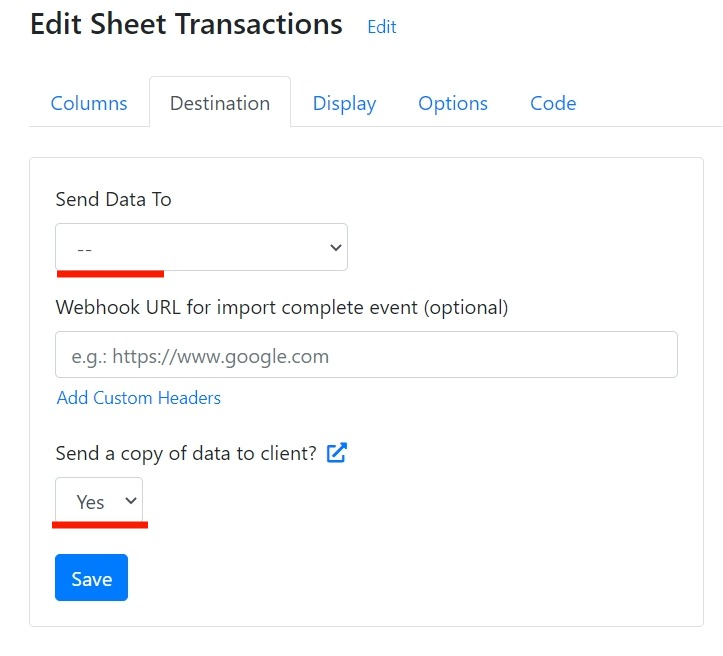

# Private Mode

CSVbox offers a variety of configurations for handling user data.

<table><thead><tr><th width="149"> </th><th width="202">Standard</th><th width="178">No Store</th><th>Private</th></tr></thead><tbody><tr><td><strong>Data Processing</strong></td><td><ul><li>Client browser</li><li>CSVbox server</li></ul></td><td><ul><li>Client browser</li><li>CSVbox server</li></ul></td><td><ul><li>Client browser</li></ul></td></tr><tr><td><strong>Data Storage</strong></td><td><ul><li>CSVbox datastore</li></ul></td><td>-</td><td>-</td></tr></tbody></table>

### Standard Mode

<figure><figcaption>
Standard Mode
</figcaption></figure>

This is the default configuration. User data is encrypted in transit and at rest. The data is pushed to your system and a copy of it is stored in the CSVbox database. It gets auto-deleted after one month. Your system can access the data from CSVbox datastore any time during this one month. Optionally the data is also available in the client browser.

### No Store Mode

<figure><figcaption>
No Store Mode
</figcaption></figure>

In this mode, the user data does not get stored in the CSVbox database. It is directly pushed to your system. Optionally the data is also available in the client browser.


Metadata that describes the import gets stored in CSVbox. This includes data such as Import ID, Import Start Time, End Time, Sheet ID, etc.


To activate this mode go to your CSVbox dashboard > Account **Settings** > For **File Delete Policy** select **Do not store the file** option.

### Private Mode

<figure><figcaption>
Private Mode
</figcaption></figure>

In the Private Mode, the user data does not transit CSVbox servers and is not stored in our databases. The data is processed in the client browser and available for consumption there. You can then choose to push the data to your system by implementing custom code.


Metadata that describes the import gets stored in CSVbox. This includes data such as Import ID, Import Start Time, End Time, Sheet ID, etc.


To activate Private Mode:

1. Go to your CSVbox dashboard > Account **Settings** > For **File Delete Policy** select **Do not store the file** option.

2. Go to Sheet **Settings** > **Destination** Tab > Select **--** for the **Send Data To** option.
3. Select **Yes** for the **Send a copy of data to client?** optio&#x6E;**.**

The user data will be available at the client in the format shown [**here**](../getting-started/3.-receive-data.md#data-at-the-client-side).
