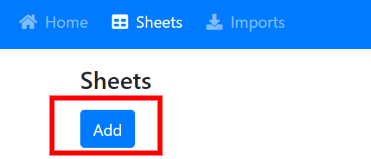
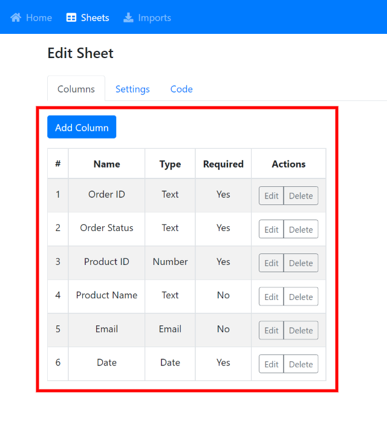
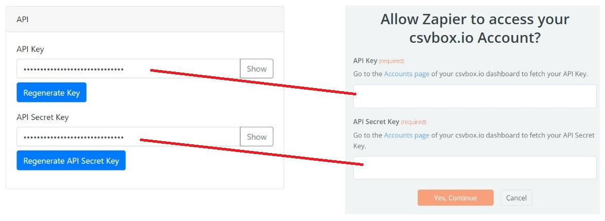

# Zapier

The data from files uploaded by the users can be pushed to Zapier as a trigger. This data can then be moved to any connected app of your choice.

Log in to [csvbox.io](https://app.csvbox.io/login).

Add a sheet.

Add columns to the sheet as per your requirement.

Under the "**Settings**" section, for the "**Send Data To**" setting select the "**Zapier**" option.

Click "**Connect Zap**".

This will redirect you to Zapier.

Log in to your Zapier account.

Create a new Zap.

Select **csvbox.io** as the Trigger.

&#x20;Select '**New Import Row**' as the Trigger Event.

Connect your csvbox.io account by providing the API Key and API Secret Key. These keys can be found on the **Accounts** page of your csvbox dashboard.

Select the sheet (template) in the 'sheets' dropdown of the 'Set up Trigger' section. Data from this sheet will be pushed to Zapier one row at a time.

Then you can Test the trigger and continue with setting up the Action of your Zap.
