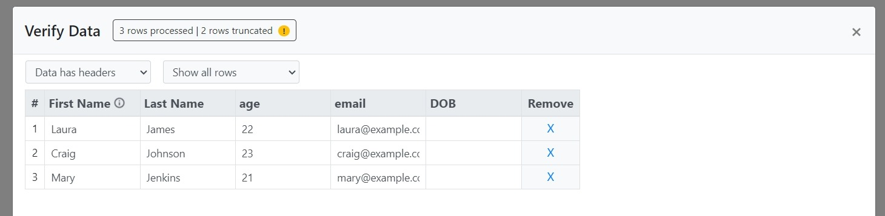

# 2. Install Code

Go to the 'Code' tab of the sheet and find the integration code. Place the code in your application at the location you want to display the import button.



Sample code with basic usage:

```javascript
<button class="btn btn-primary" data-csvbox disabled onclick="importer.openModal();">Import</button>
<script type="text/javascript" src="https://js.csvbox.io/script.js"></script>
<script type="text/javascript">
    function callback(result, data) {
        if(result){
            console.log("success");
            console.log(data.row_success + " rows uploaded");
            //custom code
        }else{
            console.log("fail");
            //custom code
        }
    }
    let importer = new CSVBoxImporter("YOUR_LICENSE_KEY_HERE",{        
    }, callback);
    
    importer.setUser({
        user_id: "default123"
    })
</script>
```


Each sheet has a unique Licence Key. Find the Licence Key of the sheet on the 'Code' tab of the sheet page and pass it to the **CSVBoxImporter** function.




Install using npm:

```javascript
npm install @csvbox/react
```

&#x20;This will give you access to the **`CSVBoxButton`** component having the basic functionality of our importer. Import the **`CSVBoxButton`** component to your project.

```javascript
import { CSVBoxButton } from '@csvbox/react'
```

Basic usage:

```javascript
<CSVBoxButton
  licenseKey="YOUR_LICENSE_KEY_HERE"
  user={{
    user_id: "default123"
  }}
  onImport={(result, data) => {
    if(result){
      console.log("success");
      console.log(data.row_success + " rows uploaded");
      //custom code
    }else{
      console.log("fail");
      //custom code
    }
  }} 
  render={(launch, isLoading)=>{
          return <button disabled={isLoading} onClick={launch}>Upload file</button>;
      }}
>
  Import
</CSVBoxButton>
```


Each sheet has a unique Licence Key. Find the Licence Key of the sheet on the Code section of the sheet page and attach it to the **licenseKey** property of the **CSVBoxButton** component.



The optional **render** property allows you to pass in your button to use in place of the standard csvbox element.




Install using npm:

```javascript
npm install @csvbox/angular
```


For Angular versions below 12 use @csvbox/angular\_8 and for Angular versions 12 and above use @csvbox/angular


Import:&#x20;

Add `CSVBoxAngularModule` to your module imports.

```javascript
import { CSVBoxAngularModule } from "@csvbox/angular";

@NgModule({
  ...
  imports: [
    ...
    CSVBoxAngularModule
  ]
})
```

Once you have this setup, in your app component file, you will be able to import and access the`CSVBoxMethods` module for use.

It will bring the `csvbox-button` component into your project. Example:

```
<csvbox-button [licenseKey]="licenseKey" [imported]="imported.bind(this)" [user]="user">Import</csvbox-button>
```

Basic usage:

```javascript
@Component({
  selector: 'app-root',
  template: `
    <csvbox-button
      [licenseKey]="licenseKey"
      [user]="user"      
      [imported]="imported.bind(this)">
      Import
    </csvbox-button>
  `
})

export class AppComponent {

  title = 'example';
  licenseKey = 'YOUR_LICENSE_KEY_HERE';
  user = { user_id: 'default123' };

  imported(result: boolean, data: any) {
    if(result) {
      console.log("Sheet uploaded successfully");
      console.log(data.row_success + " rows uploaded");
    }else{
      console.log("There was some problem uploading the sheet");
    }
  }
}
```


Each sheet has a unique Licence Key. Find the Licence Key of the sheet on the Code section of the sheet page and attach it to the **licenseKey** property of the **AppComponent**.


Styling the button:

In order to style the `<csvbox-button>` from within your parent component, ensure that your parent component has `ViewEncapsulation.None`, pass down a class to `<csvbox-button>`, and now you will be able to style the `button` one-level down.

```javascript
import { Component, ViewEncapsulation } from '@angular/core';
```

```javascript
@Component({
  selector: 'app-root',
  template: `
    <csvbox-button
      [licenseKey]="licenseKey"
      [user]="user"
      [dynamicColumns]="dynamicColumns"
      [imported]="Imported.bind(this)"
      class=“csvbox-btn”      
      >
      Import
    </csvbox-button>
  `,
  encapsulation: ViewEncapsulation.None,
  styles: [`
    .csvbox-btn button {        
        background: #007bff;
        border-radius: 3px;        
      }
  `],
export class AppComponent { 
    //...
}
```



Install using npm:

```javascript
npm install @csvbox/vuejs
```

&#x20;This will give you access to the **`CSVBoxButton`** component. Import the **`CSVBoxButton`** component to your project.

```javascript
import { CSVBoxButton } from '@csvbox/vuejs'
```

&#x20;Now just import the **`CSVBoxButton`** and include it in your Vue `components`, and you're ready to get started.

Basic usage:

```javascript
<template>
  <div id="app">
    <CSVBoxButton 
      :licenseKey="licenseKey"
      :user="user"        
      :onImport="onImport">
      Upload File
    </CSVBoxButton>
  </div>
</template>

<script>
import { CSVBoxButton } from '@csvbox/vuejs';

export default {
  name: 'App',
  components: {
    CSVBoxButton,
  },
  data: () => ({
    licenseKey: 'YOUR_LICENSE_KEY_HERE',
    user: {
      user_id: 'default123',
    },
  }),
  methods: {    
    onImport: function (result, data) {    
       if(result){
          console.log("success");
          console.log(data.row_success + " rows uploaded");
          //custom code
      }else{
          console.log("fail");
          //custom code
      }
    }
  },
}
</script>
```


Each sheet has a unique Licence Key. Find the Licence Key of the sheet on the Code section of the sheet page and attach it to the **licenseKey** property of the **CSVBoxButton** component.


> #### Implementation Demo
>
> Vue2 - [https://codesandbox.io/s/csvbox-vue2-plzl0q](https://codesandbox.io/s/csvbox-vue2-plzl0q)
>
> Vue3 - [https://codesandbox.io/s/csvbox-vue3-vuselr](https://codesandbox.io/s/csvbox-vue3-vuselr)




If your app/database is restricted to IP addresses on an allowlist, you will need to manually add CSVbox's addresses in order to use the importer.

You will have to whitelist the following IP addresses:

* `18.233.84.183`
* `18.213.249.53`
* `3.73.26.144`

Note that at any time, you will only see one of these addresses in use. However, the active IP address can change at any time, so you should add them all to your IP whitelist to ensure no interruptions in service.


### Referencing the user

You can configure **custom user attributes** in the installation code to identify the users in your platform and match them with their respective imports.&#x20;



Pass custom user attributes as input parameters to the **`setUser`**&#x6D;ethod. The custom user attributes will be pushed to your destination along with the uploaded data.

**user\_id** is the only custom attribute that is mandatory. Apart from **user\_id,** you can add up to 4 custom attributes in th&#x65;**`<key>: <value>`**&#x66;ormat. Example:

```javascript
 importer.setUser({
        user_id: "1a2b3c4d5e6f",
        team_id: "sales2",
        isAuthenticated: "true",
        permissionLevel: "admin",
        email: "abc@example.com"
    })
```



Pass custom user attributes as an object to the **`user`**&#x70;roperty of the **`CSVBoxButton`** component. The custom user attributes will be pushed to your destination along with the uploaded data.

**user\_id** is the only custom attribute that is mandatory. Apart from **user\_id,** you can add up to 4 custom attributes in the **`<key>: <value>`**&#x66;ormat. Example:

```javascript
  user={{
              user_id: "1a2b3c4d5e6f",
              team_id: "sales2",
              isAuthenticated: "true",
              permissionLevel: "admin",
              email: "abc@example.com"
  }}
```



Pass custom user attributes as an object to the **`user`**&#x70;roperty of the AppComponent. The custom user attributes will be pushed to your destination along with the uploaded data.

**user\_id** is the only custom attribute that is mandatory. Apart from **user\_id,** you can add up to 4 custom attributes in the **`<key>: <value>`**&#x66;ormat. Example:

```javascript
  user={
              user_id: "1a2b3c4d5e6f",
              team_id: "sales2",
              isAuthenticated: "true",
              permissionLevel: "admin",
              email: "abc@example.com"
 }
```



Pass custom user attributes as an object to the **`user`**&#x70;roperty of the **`CSVBoxButton`** component. The custom user attributes will be pushed to your destination along with the uploaded data.

**user\_id** is the only custom attribute that is mandatory. Apart from **user\_id,** you can add up to 4 custom attributes in the **`<key>: <value>`**&#x66;ormat. Example:

```javascript
  user: {
              user_id: "1a2b3c4d5e6f",
              team_id: "sales2",
              isAuthenticated: "true",
              permissionLevel: "admin",
              email: "abc@example.com"
  },
```



### Callback function

Once the user uploads a file the importer will return the status of the import along with metadata describing the completed import. Data is returned via two variables: **`result`** and **`data`**.&#x20;

1. **`result`** - It is of type boolean with the value **true** if the import is successful and **false** if the import fails.
2. **`data`** - It returns JSON data as shown below:

```javascript
  {
    "import_id": 79418895,
    "sheet_id": 575,
    "sheet_name": "Products Import",
    "destination_type": "webhook"
    "row_count": 100,
    "row_success": 98,
    "row_fail": 2,
    "import_status": "Partial",
    "import_starttime": 87987897897,
    "import_endtime": 90890890809,
    "original_filename": "example-1.csv",
    "raw_file": "https://file-download-link",
    "custom_fields": {
      "user_id": "Z1001"
    },
    "column_mappings": [
      { "Name": "Name" },
      { "SKU": "Product SKU" },
      { "Price": "Sale Price" },
      { "Quantity": "Inventory"},
      { "Image URL": "Img"}    
    ]
  }
```


The data object will be null if the import fails



You can also configure the importer to receive the entire file data in JSON format in the **data** object above. More information [here](3.-receive-data.md#data-at-the-client-side).


You can write custom code to handle the success or failure conditions client side.



The **`result`** and **`data`**&#x76;ariables will be available in the **`callback`**&#x66;unction that is triggered when the import is completed.

```javascript
function callback(result, data) {
        if(result){
            console.log("success");
            console.log(data.row_success + " rows uploaded");
            //custom code
        }else{
            console.log("fail");
            //custom code
        }
    }
```



Pass additional options as an object to the **`user`**&#x70;roperty of the **`CSVBoxButton`** component. The custom user attributes will be pushed to your destination along with the uploaded data.

**user\_id** is the only custom attribute that is mandatory. Apart from **user\_id,** you can add up to 4 custom attributes in the **`<key>: <value>`**&#x66;ormat. Example:

```javascript
  user={{
              user_id: "1a2b3c4d5e6f",
              team_id: "sales2",
              isAuthenticated: "true",
              permissionLevel: "admin",
              email: "abc@example.com"
  }}
```



The **`imported`** property provides access to the **`result`** and **`data`**&#x76;ariables via the specified callback function.

```javascript
  imported(result: boolean, data: any) {
    if(result) {
      console.log("Sheet uploaded successfully");
      console.log(data.row_success + " rows uploaded");
    }else{
      console.log("There was some problem uploading the sheet");
    }
  }
```



The **`onImport`** property provides access to the **`result`** and **`data`**&#x76;ariables.

```javascript
onImport: function (result, data) {    
       if(result){
          console.log("success");
          console.log(data.row_success + " rows uploaded");
          //custom code
      }else{
          console.log("fail");
          //custom code
      }
}
```



### Options

Here is the list of additional configuration options available with the CSVbox importer.

#### max\_rows

* Type: <mark style="background-color:blue;">number</mark>&#x20;
* Default: <mark style="background-color:blue;">null</mark>&#x20;
*   Description:

    Specify the maximum number of rows that a single file can import. This value excludes the headers of the file. So if the number of rows in a sheet is 101, but the first row is the header, then this file would be considered to have 100 data rows in it.

<figure><figcaption><p>Max Limit Message</p></figcaption></figure>

#### max\_rows\_allow\_submit

* Type: <mark style="background-color:blue;">boolean</mark>
* Default: <mark style="background-color:blue;">true</mark>
*   Description:

    Allow or disallow submission of the permissible number of rows when the overall row count exceeds the limit. Consider row limit (**max\_rows**) is set to 5. If **max\_rows\_allow\_submit is** set to **true** then the user can upload the top 5 rows of his file. If **max\_rows\_allow\_submit is** set to **false** then the user will not be able to submit even 1 row if the overall row count exceeds **max\_rows**.

#### max\_rows\_custom\_message

* Type: <mark style="background-color:blue;">string</mark>
* Default: <mark style="background-color:blue;">null</mark>
*   Description:

    Display a custom message to the user when the file row count is greater than **max\_rows**. This message will show only when **max\_rows\_allow\_submit** is set to **false**.

<figure><figcaption><p>Custom Message for Max Row Limit</p></figcaption></figure>

#### min\_rows

* Type: <mark style="background-color:blue;">number</mark>&#x20;
* Default: <mark style="background-color:blue;">null</mark>&#x20;
*   Description:

    The minimum number of rows that is required for a single upload.&#x20;

#### min\_rows\_custom\_message

* Type: <mark style="background-color:blue;">string</mark>
* Default: <mark style="background-color:blue;">null</mark>
*   Description:

    Display a custom message when the file row count is less than **min\_rows**.

#### language

* Type: <mark style="background-color:blue;">string</mark>&#x20;
* Default: <mark style="background-color:blue;">null</mark>&#x20;
*   Description:

    Specify the importer frontend language. This value will override the default language option configured via the csvbox dashboard. Acceptable values are:

<table><thead><tr><th width="150">Value</th><th>Language</th></tr></thead><tbody><tr><td>en</td><td>English</td></tr><tr><td>de</td><td>German</td></tr><tr><td>fr</td><td>French</td></tr><tr><td>es</td><td>Spanish</td></tr><tr><td>nl</td><td>Dutch</td></tr><tr><td>pt</td><td>Portuguese</td></tr><tr><td>th</td><td>Thai</td></tr><tr><td>pl</td><td>Polish</td></tr><tr><td>ro</td><td>Romanian</td></tr><tr><td>he</td><td>Hebrew</td></tr><tr><td>jp</td><td>Japenese</td></tr><tr><td>da</td><td>Danish</td></tr><tr><td>tr</td><td>Turkish</td></tr><tr><td>sk</td><td>Slovak</td></tr><tr><td>hi</td><td>Hindi</td></tr><tr><td>ms</td><td>Bahasa Malaysia (Malay)</td></tr><tr><td>ru</td><td>Russian </td></tr><tr><td>vi</td><td>Vietnamese </td></tr><tr><td>ko</td><td>Korean </td></tr><tr><td>id</td><td>Bahasa Indonesia</td></tr><tr><td>ar-EG</td><td>Egyptian Arabic</td></tr><tr><td>ur</td><td>Urdu </td></tr></tbody></table>

#### allow\_invalid

* Type: <mark style="background-color:blue;">boolean</mark>&#x20;
* Default: <mark style="background-color:blue;">0</mark>&#x20;
*   Description:

    It specifies if the users can continue to submit the file even if there are validation errors.

#### request\_headers

* Type: <mark style="background-color:blue;">{ key: value, key: value, ... }</mark>&#x20;
* Default: <mark style="background-color:blue;">null</mark>&#x20;
*   Description:

    This is where you define additional headers that get passed with each HTTP request.

#### dynamic\_list\_request\_headers

* Type: <mark style="background-color:blue;">{ key: value, key: value, ... }</mark>&#x20;
* Default: <mark style="background-color:blue;">null</mark>&#x20;
*   Description:

    This is where you define additional headers that get passed with each HTTP request for the [dynamic list API](../dashboard-settings/validations.md#dynamic-list).

#### sample\_template\_url

* Type: <mark style="background-color:blue;">String</mark>&#x20;
* Default: <mark style="background-color:blue;">null</mark>&#x20;
*   Description:

    It is the URL to download the sample CSV file for the end users.

#### sample\_template\_button\_text

* Type: <mark style="background-color:blue;">String</mark>&#x20;
* Default: <mark style="background-color:blue;">null</mark>&#x20;
*   Description:

    It specifies the text on the button for downloading the sample CSV file.


The **sample\_template\_url** and the **sample\_template\_button\_text** options can be used to provide the end users with a customized dynamic sample CSV file.




<mark style="color:orange;">Examples:</mark>



Pass additional options as input parameters to the **`setOptions`**&#x6D;ethod.

```javascript
importer.setOptions({
    max_rows: 50,
    language: 'de',
    request_headers: {
            "Content-Type": "application/json",
            "X-Access-Token": "71ab1d73a4d1319b260e9a0sdbdbc1c"
    },
    sample_template_url: 'https://files.myapp.com/user-18768',
    sample_template_button_text: 'Starter Template' 
})
```



Pass the additional options as an object to the **`options`**&#x70;roperty of the **`CSVBoxButton`** component.&#x20;

```javascript
  options={{
              max_rows: 50,
              language: 'de',     
              request_headers: {
                        "Content-Type": "application/json",
                        "X-Access-Token": "71ab1d73a4d1319b260e9a0sdbdbc1c"
                  },
              sample_template_url: 'https://files.myapp.com/user-18768',
              sample_template_button_text: 'Starter Template'              
  }}
```



Pass the additional options as an object to the **`options`**&#x70;roperty of the AppComponent.&#x20;

```javascript
  options={
              max_rows: 50,
              language: 'de',
              request_headers: {
                        "Content-Type": "application/json",
                        "X-Access-Token": "71ab1d73a4d1319b260e9a0sdbdbc1c"
                },
              sample_template_url: 'https://files.myapp.com/user-18768',
              sample_template_button_text: 'Starter Template'                     
 }
```



Pass the additional options as an object to the **`options`**&#x70;roperty of the **`CSVBoxButton`** component.&#x20;

```javascript
  options: {
              max_rows: 50,
              language: 'de',
              request_headers: {
                        "Content-Type": "application/json",
                        "X-Access-Token": "71ab1d73a4d1319b260e9a0sdbdbc1c"
                },
              sample_template_url: 'https://files.myapp.com/user-18768',
              sample_template_button_text: 'Starter Template'    
  },
```



#### target\_file\_name

* Type: <mark style="background-color:blue;">String</mark>&#x20;
* Default: <mark style="background-color:blue;">null</mark>&#x20;
*   Description:

    It specifies the name of the file that gets pushed to your destination. This is applicable for the following destinations only:

    * s3
    * FTP Server
    * Google Sheets

#### upload\_file\_url

* Type: <mark style="background-color:blue;">String</mark>&#x20;
* Default: <mark style="background-color:blue;">null</mark>&#x20;
*   Description:

    The URL of the file to be imported. This is useful in cases where you want the data to be pre-loaded into the importer without asking the users to upload the file. Simply provide the file location and the importer will load the data when the user clicks the Import button.

#### upload\_file\_worksheet\_name

* Type: <mark style="background-color:blue;">String</mark>&#x20;
* Default: <mark style="background-color:blue;">null</mark>&#x20;
*   Description:

    The name of the worksheet that should be uploaded if you are uploading a file with multiple tabs via [**upload\_file\_url** ](2.-install-code.md#upload_file_url)option.

#### theme

* Type: <mark style="background-color:blue;">String</mark>&#x20;
* Default: <mark style="background-color:blue;">null</mark>&#x20;
*   Description:

    Initializes the importer with the specified theme. Supported values:\
    `light`, `light-custom`, `dark`, `dark-custom`. If not specified, the theme set in the sheet dashboard will be used by default.

#### **default\_header\_row**

* Type: number
* Default: 1
* Description:\
  Row to auto-select as the header on the Header Selection page (rows are 1-indexed).

### Events

Here is the list of additional importer events/properties:

#### onReady

Triggers when the importer is initialized and ready for use by the users. The users can then click the Import button to open the Importer modal dialog.

#### onLoadStart

Triggers when the importer iFrame starts loading.


In vanilla Javascript, onLoadStart will trigger only when the [Lazy Load](2.-install-code.md#lazy-load) is activated. Without Lazy Load, the iframe loading starts as soon as the importer is initialized.


#### onClose

Triggers when the importer is closed.

#### onSubmit

Triggers when the user hits the 'Submit' button to upload the validated file. **`data`** object is available in this event. It contains metadata related to the import.&#x20;

<details>

<summary>onSubmit <code>Data</code> object sample</summary>

```json
{
  "import_id": 79418895,
  "sheet_id": 575,
  "sheet_name": "Products Import",
  "destination_type": "webhook",
  "row_count": 100,
  "import_starttime": 87987897897,
  "original_filename": "example-01.csv",
  "custom_fields": {
    "user_id": "Z1001"
  },
  "column_mappings": [
    {
      "Item": "Product Name"
    },
    {
      "SKU": "Product SKU"
    },
    {
      "Price": "Sale Price"
    },
    {
      "Quantity": "Inventory"
    },
    {
      "Image URL": "Img"
    }
  ]
}
```

</details>

#### onImport

Triggers when all the data is pushed to the destination. Two objects are available in this event:

1. **`result`** (boolean): It is true when the import is successful and false when the import fails.
2. **`data`** (object): Contains metadata related to the import.

#### <mark style="color:orange;">Examples:</mark>



```javascript
<button class="btn btn-primary" data-csvbox disabled onclick="importer.openModal();">Import</button>
<script type="text/javascript" src="https://js.csvbox.io/script.js"></script>
<script type="text/javascript">
       function callback(result, data) {
           if(result){
               console.log("Sheet uploaded successfully");
               console.log(data.row_success + " rows uploaded");
           }else{
               console.log("There was some problem uploading the sheet");
           }
       }
       let importer = new CSVBoxImporter("YOUR_LICENSE_KEY_HERE",{}, callback);
       importer.setUser({
           user_id: 'default123'
       });
       
       importer.listen("onReady", function(){
        console.log("onReady");
       });
       
       importer.listen("onClose", function(){
        console.log("onClose");
       });
       
        importer.listen("onSubmit", function(data){
        console.log("onSubmit");
        console.log(data.import_id);
       });
       
</script>    
```



```javascript
import React from "react";

import { CSVBoxButton } from "@csvbox/react";

const App = () => {
  return (
    <CSVBoxButton
      licenseKey="YOUR_LICENSE_KEY_HERE"
      lazy={true}
      user={{
        user_id: "default123"
      }}
      onImport={(result, data) => {
        if (result) {
          console.log("success");
          console.log(data.row_success + " rows uploaded");
          //custom code
        } else {
          console.log("fail");
          //custom code
        }
      }}
      loadStarted={() => {
        console.log("loadStarted");
      }}
      onReady={() => {
        console.log("onReady");
      }}
      onClose={() => {
        console.log("onclosed");
      }}
      onSubmit={(data) => {
        console.log("onSubmit");
        console.log(data.import_id);
      }}
    >
      Import
    </CSVBoxButton>
  );
};

export default App;
```




The events are named slightly differently for Angular.


| Event       | Angular Event |
| ----------- | ------------- |
| onReady     | importerReady |
| onLoadStart | loadStarted   |
| onClose     | closed        |
| onSubmit    | submitted     |
| onImport    | imported      |


```javascript
import { Component } from '@angular/core';

@Component({
  selector: 'app-root',
  template: `
    <csvbox-button
      [licenseKey]="licenseKey"
      [user]="user"
      [dynamicColumns]="dynamicColumns"
      [imported]="imported.bind(this)"
      [closed]="closed.bind(this)"
      [submitted]="submitted.bind(this)"
      [importerReady]="importerReady.bind(this)">
      Import
    </csvbox-button>
  `
})
export class AppComponent {

  title = 'example';
  licenseKey = 'YOUR_LICENSE_KEY_HERE';
  user = { user_id: 'default123' };
  dynamicColumns = [
    {
      column_name: 'col2',
      type: 'text'
    }
  ];

  imported(result: boolean, data: any) {
    console.log("result", result, "data", data)
    if(result) {
      console.log("Sheet uploaded successfully");
      console.log(data.row_success + " rows uploaded");
    }else{
      console.log("There was some problem uploading the sheet");
    }
  }
  
  loadStarted() {
    console.log("loadStarted");
  }

  closed(){
    console.log("onClose");
  }

  importerReady(){
    console.log("onReady");
  }

  submitted(data: any){
    console.log("onSubmit");
    console.log(data.import_id);
  }
}
```



```javascript
<template>
  <div>
    <CSVBoxButton 
      licenseKey="YOUR_LICENSE_KEY_HERE" 
      :user="{ user_id: 'default123' }" 
      :onImport="onImport"
      :onReady="onReady"
      :onClose="onClose"
      :onSubmit="onSubmit"
      >Import</CSVBoxButton>

  </div>
</template>
<script>

import CSVBoxButton from './components/CSVBoxButton'

export default {
  name: 'App',
  components: {
    CSVBoxButton
  },
  methods: {
    onImport(result, data){
      console.log("onImport", result, data);
      if(result){
        console.log("success");
        console.log(data.row_success + " rows uploaded");
        //custom code
      }else{
        console.log("fail");
        //custom code
      }
    },
    onReady(){
      console.log("onReady");
    },
    onClose(){
      console.log("onClose");
    },
     onSubmit(data){
      console.log("onSubmit");
      console.log(data.import_id);
    }
  },
  mounted() {
    
  },
}
</script>
```



### Other Settings

### Lazy Load

The importer assets are loaded on the webpage load. This can sometimes slow the app if you initialize multiple importers on the same page. As a workaround, you can defer the loading of the importer assets to the Import button click. This can be done by adding the `lazy: true` parameter to the initialization code.



```javascript
let importer = new CSVBoxImporter("YOUR_LICENSE_KEY_HERE",{        
    }, callback, { lazy: true });

```



```javascript
import { CSVBoxButton } from '@csvbox/react'
import './App.css';

function App() {
  return (
    <div className="App">
      <CSVBoxButton
        licenseKey="YOUR_LICENSE_KEY_HERE"
        user={{
          user_id: "default123"
        }}
        onImport={(result, data) => {
          if(result){
            console.log("success");
            console.log(data.row_success + " rows uploaded");
            //custom code
          }else{
            console.log("fail");
            //custom code
          }
        }}
        lazy={true}
      >
        Import
      </CSVBoxButton>
    </div>
  );
}

export default App;
```



```javascript
@Component({
  selector: 'app-root',
  template: `
    <csvbox-button
      [licenseKey]="licenseKey"
      [user]="user"
      [imported]="imported.bind(this)"
      [lazy]="lazy">
      Import
    </csvbox-button>
  `
})
export class AppComponent {
  title = 'csvbox-test';
  licenseKey = 'YOUR_LICENSE_KEY_HERE';
  user = { user_id: 'default123' };
  lazy = true;
  imported(result: boolean, data: any) {
    if(result) {
      console.log("Sheet uploaded successfully");
      console.log(data.row_success + " rows uploaded");
    }else{
      console.log("There was some problem uploading the sheet");
    }
  }
}
```



```javascript
<CSVBoxButton
      :licenseKey="licenseKey"
      :user="user"      
      :onImport="onImport"
      :lazy="true">
      Upload File
</CSVBoxButton>
```



