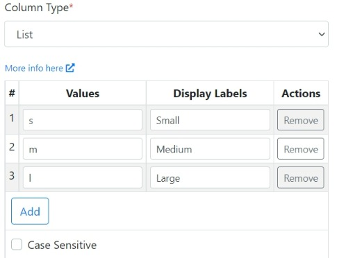

# Validations

## Column Data Types

While creating a sheet you can specify the column to be any of the data types mentioned below. If the incoming CSV data does not match the column data type (and its validation rules), then the user will see a relevant error message identifying what the problem is and how to fix it.  

### Text

This is the default column data type. It accepts any alphanumeric string. You can provide the `Min Length` and `Max Length` parameters to specify the acceptable length of the text data.

### Number

This **Number** column data type accepts integer and float strings only. Additionally, you can provide the `Min Value` and `Max Value` parameters to specify the acceptable range of numbers.

### Email

The column under validation must be formatted as an email address.

### Date

The column under validation must be formatted as a date. You have to select a `Date Format` from the dropdown list to specify the acceptable format. The default format is '_MM/DD/YYYY_'. If your desired format is not found in the list, simply email us and we will try and add your requested format.

### Boolean

The column under validation must be able to be cast as a boolean. Accepted inputs are _true_, _false_, _TRUE_, _FALSE_, _1_, _0_, _yes_, _no_, _y_, _n_, _on_, _off_, _enabled,_ and _disabled_.

### Regex

The column data must match the given regular expression. You need to specify the `Regex` and the importer will pattern match it with the incoming data. 

### IP

The column under validation must be an IP address. You have to select the `IP Version`.

### URL

The column under validation must be a valid URL.

### Credit Card

The column under validation must be formatted as a credit card number. Acceptable formats are _5555555555554444_,_ 5555-5555-5555-4444_ and _5555 5555 5555 4444_.

### List

With the **List** data type, you can specify a list of acceptable values. The importer will compare the CSV column data with the list of acceptable values and throw a validation error if there is a mismatch. You can specify a list of acceptable `Values `and related `Display Labels`. The importer will match the column data with the list of `Display Labels`. If the data passes validation then the `Values `corresponding to the `Display Labels` will be pushed to the destination. For example say, you configure the List column as shown below:

In this case, the acceptable data in the CSV column will be _Small_, _Medium_, and _Large_. Based on the actual data found in the user CSV, the values _s_, _m_ or _l_ will be pushed to your data destination. This allows you to accept readable values from your users while pushing data to your system that is in a format it understands.

## Other Validation Options

### Column Required

You can check/uncheck the `Required `checkbox on the Column Settings window. The column data must be present, and not empty if the `Required `checkbox is ticked.
